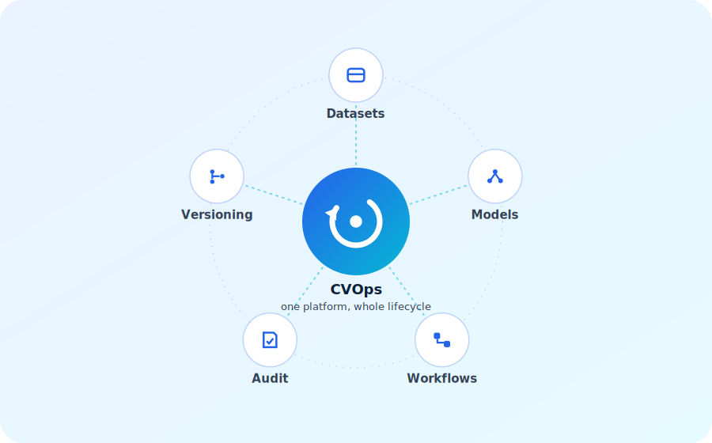
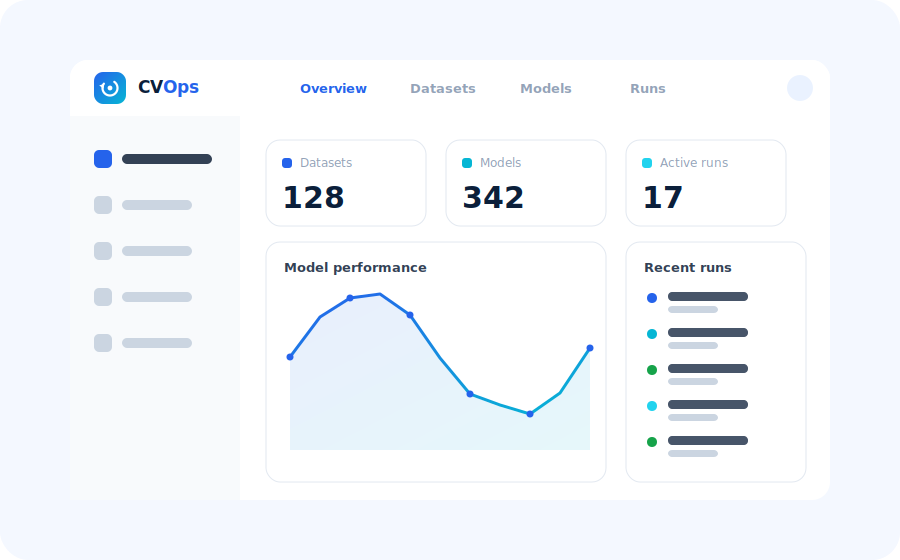

<div align="center">

<picture>
  <source media="(prefers-color-scheme: dark)" srcset="brand/logo-primary-dark.svg">
  <source media="(prefers-color-scheme: light)" srcset="brand/logo-primary-light.svg">
  
</picture>

<br><br>

**The ML lifecycle dashboard that replaces five fragmented tools.**

Track datasets · version models · orchestrate workflows · audit everything - in one place.

<br>

[](https://github.com/YehudaBriskman/CVOps/actions/workflows/ci-api.yml)
[](https://github.com/YehudaBriskman/CVOps/actions/workflows/lint-api.yml)
[](https://www.python.org/downloads/)
[](https://fastapi.tiangolo.com)
[](manifests/docker-compose.yml)
[](LICENSE)

<br>



</div>

---

## The Problem

ML teams typically manage 6–10 separate tools: one for data labelling, one for dataset versioning, one for experiment tracking, one for model registry, one for pipeline scheduling, one for training job dispatch. These tools don't talk to each other. Lineage breaks. Bugs hide at integration points. Reproducing a trained model requires an archaeology expedition.

**CVOps collapses that stack into a single, versioned, auditable system** - from raw video to production model weight, every step is tracked, every artifact is content-addressed, every transition is logged.

```
raw video / images
       │
       ▼
  extract frames        ← step: runs inside Docker, outputs frame manifest
       │
       ▼
   auto-label           ← step: calls CVAT or in-house model, outputs annotation refs
       │
       ▼
 human review (CVAT)   ← gate: workflow pauses, waits for operator to accept/reject
       │
       ▼
  commit dataset        ← step: creates immutable Commit on the Dataset object
       │
       ▼
  export to YOLO        ← step: builds YOLO annotation package, uploads to Garage S3
       │
       ▼
 dispatch training      ← step: launches Docker training container, tails logs
       │
       ▼
  model_version ✓       ← step: registers weights + metadata in the Model Registry
```

Every node in that graph is a **Step** - composable, versioned, idempotent. Every edge is tracked. Every artifact is a content-addressed blob.

---

### Dashboard

<div align="center">

</div>

---

## Key Features

- **Dataset versioning** - Git-like commits, refs (branches/tags), and set-diffs on labelled image collections. Roll back, branch, and compare datasets the same way you branch code.
- **DAG workflow engine** - Define pipelines as directed acyclic graphs. Step outputs are wired to downstream inputs via typed `$steps.<id>.outputs.<name>` references. The engine resolves them at runtime.
- **Human-in-the-loop gates** - Any step can be a gate that pauses the run. An operator resolves the gate via API; the engine resumes from exactly where it stopped.
- **Idempotent execution** - Steps are fingerprinted by `sha256(type + config + resolved inputs)`. Re-running a workflow reuses outputs from identical prior steps - no redundant compute.
- **Content-addressed blob storage** - Every image, annotation file, and model weight is stored by SHA-256 hash in Garage (S3-compatible). Clients receive presigned S3 URLs. Duplicate uploads are free.
- **Append-only audit log** - Every status transition emits an `Event`. Nothing is deleted. You can replay the full history of any run.
- **Redis-backed token revocation** - JWTs carry a unique `jti` claim. Revoked tokens are blacklisted in Redis for the remainder of their lifetime. Refresh rotation is atomic.
- **Org-scoped multi-tenancy** - All resources are scoped to `org_id`. Cross-org access is blocked at the DB query level, not the application layer.

---

## Quick Start

**Requires (dev):** Docker, Python 3.12+, Node 20+, [Tilt](https://docs.tilt.dev/install.html).
**Requires (pre-prod):** Docker + Docker Compose.

```bash
# 1. Clone and configure
git clone https://github.com/YehudaBriskman/CVOps.git
cd CVOps
cp manifests/.env.example manifests/.env   # fill in JWT_SECRET and Garage secrets

# 2a. Inner-loop dev: infra in compose, api+frontend as host processes
tilt up

# 2b. Pre-prod / integration test (everything containerised):
cd manifests
docker compose --profile app up           # prod-target api + frontend + nginx + infra
```

In dev mode the nginx edge serves the placeholder UI and proxies `/api/v1/*` to the host API at `http://localhost`; Vite additionally routes `/api/*` to `http://localhost:8000` for the React app at `http://localhost:5173`. Behind nginx the API is mounted under the versioned `/api/v1` prefix.

In ~30 seconds you have:

| Service | URL |
|---|---|
| REST API | http://localhost:8000 |
| Interactive API docs | http://localhost:8000/docs |
| Garage admin API | http://localhost:3903 |

**Smoke test - register and make your first project:**

```bash
# Register (creates an Org automatically)
TOKEN=$(curl -s -X POST http://localhost:8000/auth/register \
  -H "Content-Type: application/json" \
  -d '{"email":"you@example.com","password":"hunter2","org_name":"ACME"}' \
  | python3 -c "import sys,json; print(json.load(sys.stdin)['access_token'])")

# Create a project
curl -s -X POST http://localhost:8000/projects \
  -H "Authorization: Bearer $TOKEN" \
  -H "Content-Type: application/json" \
  -d '{"name":"helmet-detection","description":"PPE compliance on construction sites"}' \
  | python3 -m json.tool
```

Expected output:

```json
{
  "id": "018f4b2a-...",
  "name": "helmet-detection",
  "description": "PPE compliance on construction sites",
  "org_id": "018f4b29-...",
  "created_at": "2025-06-08T12:00:00Z",
  "deleted_at": null
}
```

---

## Walkthrough: End-to-end in 10 minutes

This section walks through the full lifecycle using `curl`. All IDs below are placeholders -- substitute your own.

### 1. Upload a data source

```bash
# Request a presigned PUT URL for your zip of images
UPLOAD=$(curl -s -X POST http://localhost:8000/projects/$PROJECT_ID/data-sources \
  -H "Authorization: Bearer $TOKEN" \
  -H "Content-Type: application/json" \
  -d '{"name":"site-footage-2025-06","media_type":"image/jpeg"}')

UPLOAD_URL=$(echo $UPLOAD | python3 -c "import sys,json; print(json.load(sys.stdin)['upload_url'])")
SOURCE_ID=$(echo $UPLOAD | python3 -c "import sys,json; print(json.load(sys.stdin)['data_source']['id'])")

# Upload directly to Garage (bypasses the API - no proxying of raw bytes)
curl -X PUT "$UPLOAD_URL" \
  -H "Content-Type: image/jpeg" \
  --data-binary @./site-footage.zip

# Confirm the upload. The backend registers the blob and, if the project has a
# default_ingest_workflow_id set, auto-dispatches that workflow (params.source_id)
# and returns its run_id — no manual run creation needed. The blob hash is
# verified lazily when extract_frames reads the bytes.
curl -s -X POST http://localhost:8000/data-sources/$SOURCE_ID/confirm-upload \
  -H "Authorization: Bearer $TOKEN" \
  -H "Content-Type: application/json" \
  -d '{"blob_hash":"sha256:e3b0c4..."}'
# → {"data_source": {...}, "run_id": "..." | null}
```

### 2. Define an ontology

```bash
# Create a label ontology for the project
ONT_ID=$(curl -s -X POST http://localhost:8000/projects/$PROJECT_ID/ontologies \
  -H "Authorization: Bearer $TOKEN" \
  -H "Content-Type: application/json" \
  -d '{"name":"PPE Classes"}' \
  | python3 -c "import sys,json; print(json.load(sys.stdin)['id'])")

# Add label classes
curl -s -X POST http://localhost:8000/ontologies/$ONT_ID/classes \
  -H "Authorization: Bearer $TOKEN" \
  -H "Content-Type: application/json" \
  -d '{"name":"helmet","color":"#22c55e","supercategory":"PPE"}'

curl -s -X POST http://localhost:8000/ontologies/$ONT_ID/classes \
  -H "Authorization: Bearer $TOKEN" \
  -H "Content-Type: application/json" \
  -d '{"name":"no-helmet","color":"#ef4444","supercategory":"PPE"}'
```

### 3. Create and run a workflow

```bash
# Define a two-step pipeline: extract frames → auto-label
# (gate step added before the label commit)
WORKFLOW_ID=$(curl -s -X POST http://localhost:8000/projects/$PROJECT_ID/workflows \
  -H "Authorization: Bearer $TOKEN" \
  -H "Content-Type: application/json" \
  -d '{
    "name": "ingest-and-label",
    "definition": {
      "steps": [
        {
          "id": "extract",
          "type_key": "cvops.extract_frames",
          "config": {"fps": 2, "max_frames": 500}
        },
        {
          "id": "label",
          "type_key": "cvops.auto_label",
          "config": {"model": "grounding-dino", "ontology_id": "'$ONT_ID'"}
        },
        {
          "id": "review",
          "type_key": "cvops.human_review_gate",
          "config": {}
        }
      ],
      "edges": [
        {"from": "extract", "to": "label"},
        {"from": "label", "to": "review"}
      ]
    }
  }' | python3 -c "import sys,json; print(json.load(sys.stdin)['id'])")

# Launch a run - engine executes steps in topological order
RUN_ID=$(curl -s -X POST http://localhost:8000/workflows/$WORKFLOW_ID/runs \
  -H "Authorization: Bearer $TOKEN" \
  -H "Content-Type: application/json" \
  -d '{"input_refs": {"params": {"source_id": "'$SOURCE_ID'"}}}' \
  | python3 -c "import sys,json; print(json.load(sys.stdin)['id'])")
```

### 4. Watch the run in real-time (SSE)

```bash
# Server-sent events stream - each line is a JSON event
curl -N http://localhost:8000/runs/$RUN_ID/events/stream \
  -H "Authorization: Bearer $TOKEN"
```

Output (streamed line by line):

```
data: {"id":"...","run_id":"...","kind":"status_change","payload":{"status":"running"},"created_at":"..."}
data: {"id":"...","run_id":"...","kind":"step_started","payload":{"step_id":"extract"},"created_at":"..."}
data: {"id":"...","run_id":"...","kind":"step_succeeded","payload":{"step_id":"extract","outputs":{"frame_count":412}},"created_at":"..."}
data: {"id":"...","run_id":"...","kind":"step_started","payload":{"step_id":"label"},"created_at":"..."}
data: {"id":"...","run_id":"...","kind":"gate_reached","payload":{"step_id":"review","gate_data":{...}},"created_at":"..."}
```

### 5. Resolve the human review gate

```bash
# Operator inspects annotations, then resolves
curl -s -X POST http://localhost:8000/runs/$RUN_ID/gates/review/resolve \
  -H "Authorization: Bearer $TOKEN" \
  -H "Content-Type: application/json" \
  -d '{"decision":"accept","notes":"Labels look good, <5% error rate"}'
```

The engine resumes. The run completes. A new Dataset Commit is created.

---

## Architecture

```
                          ┌──────────────────────────────────┐
                          │           nginx (:80)            │
                          └────────────┬─────────────────────┘
                                       │
              ┌────────────────────────┼─────────────────────────┐
              │                        │                         │
              ▼                        ▼                         │
   React SPA (:3000)          FastAPI (:8000)                    │
   TypeScript · Vite          SQLAlchemy 2.0                     │
   TanStack Query             Pydantic v2                        │
   Zustand                    python-jose                        │
                                       ┬                         │
              ┌────────────────────────┼────────────────────┬────┘
              │                        │                    │
              ▼                        ▼                    ▼
      PostgreSQL 16           Garage (S3-compatible)    Redis 7
      21 ORM models           Content-addressed          JWT JTI
      Alembic migrations      blobs (SHA-256)            blacklist
      asyncpg driver          Presigned URLs
```

**Request lifecycle:**

```
Client  →  nginx  →  FastAPI  →  Depends(get_current_user)
                                    │
                                    ├─ decode JWT
                                    ├─ check Redis blacklist
                                    └─ load User from postgres
                                         ┬
                                         ▼
                                   Router handler
                                         ┬
                              ┌──────────┴──────────┐
                              ▼                     ▼
                         postgres              Garage
                         (reads/writes)     (presigned URLs)
```

**Workflow execution** runs **out of process** on Redis Streams (doorbell) with Postgres as the authority — the `/runs` POST returns immediately and a worker does the work:

```
POST /workflows/{id}/runs  →  201 {"id": "...", "status": "pending"}
                                     │
                       advance_workflow()  (synchronous, in-request)
                          ├─ topological sort (Kahn's)
                          ├─ for each ready step: create pending child run,
                          │     freeze resolved inputs, compute idem key (sha256)
                          └─ XADD {job_id, step_type, queue} → Redis Stream
                                     │
                       worker-preprocessing  (separate process)
                          ├─ XREADGROUP, claim child (FOR UPDATE SKIP LOCKED)
                          ├─ process_step(): run step_impl.run(), write results
                          │     ├─ GateException → status=waiting
                          │     └─ error        → status=failed
                          └─ on success → advance_workflow() enqueues next ready steps
```

---

## Packages

| Package | Language | Status | Description |
|---|---|---|---|
| `services/api` | Python 3.12 · FastAPI | ✅ Complete | REST API, workflow engine, DB layer - 21 models, 40+ endpoints, 146 tests |
| `services/frontend` | TypeScript · React 18 | 🚧 In progress | Dashboard UI - Vite · TanStack Query · Zustand · @xyflow/react |
| `packages/steps` | Python | 🚧 Pending | Step implementations: `extract_frames`, `auto_label`, `export_yolo`, `train` |
| `services/worker-preprocessing` | Python · Redis Streams | ✅ Complete | Consumes the `preprocessing` stream; runs steps out of the API process |

---

## API Reference

All endpoints except `/auth/*` require `Authorization: Bearer <token>`.

<details>
<summary><strong>Auth</strong> - 5 endpoints</summary>

| Method | Path | Description |
|---|---|---|
| `POST` | `/auth/register` | Register user + org, returns token pair |
| `POST` | `/auth/token` | Login with email + password |
| `POST` | `/auth/refresh` | Rotate token pair (old refresh token blacklisted) |
| `POST` | `/auth/revoke` | Blacklist access + refresh tokens in Redis |
| `GET` | `/auth/me` | Current user info |

</details>

<details>
<summary><strong>Orgs & Members</strong> - 6 endpoints</summary>

| Method | Path | Description |
|---|---|---|
| `GET` | `/orgs/current` | Get current org |
| `PATCH` | `/orgs/current` | Update org name |
| `GET` | `/orgs/current/members` | List members with roles |
| `POST` | `/orgs/current/members` | Invite a member |
| `PATCH` | `/orgs/current/members/{user_id}` | Update member role |
| `DELETE` | `/orgs/current/members/{user_id}` | Remove member |

</details>

<details>
<summary><strong>Projects</strong> - 5 endpoints</summary>

| Method | Path | Description |
|---|---|---|
| `GET` | `/projects` | List projects (org-scoped) |
| `POST` | `/projects` | Create project |
| `GET` | `/projects/{id}` | Get project |
| `PATCH` | `/projects/{id}` | Update project |
| `DELETE` | `/projects/{id}` | Soft-delete project |

</details>

<details>
<summary><strong>Data Sources</strong> - 5 endpoints</summary>

| Method | Path | Description |
|---|---|---|
| `GET` | `/projects/{id}/data-sources` | List data sources |
| `POST` | `/projects/{id}/data-sources` | Create + get presigned PUT URL |
| `POST` | `/data-sources/{id}/confirm-upload` | Confirm upload with blob hash |
| `GET` | `/data-sources/{id}` | Get data source |
| `DELETE` | `/data-sources/{id}` | Delete data source |

</details>

<details>
<summary><strong>Samples, Ontologies, Datasets, Workflows, Runs, Models, Training Containers</strong></summary>

Full endpoint table: **40+ endpoints total** - see the [interactive API docs](http://localhost:8000/docs) for the complete reference with request/response schemas.

Highlights:
- `GET /projects/{id}/samples?cursor=&source_id=&limit=50` - cursor-based pagination
- `GET /samples/{id}/image-url` - presigned GET URL (15-min TTL)
- `GET /runs/{id}/events/stream` - SSE stream, closes on terminal status
- `POST /runs/{id}/gates/{step_id}/resolve` - resume a paused workflow
- `GET /datasets/{id}/diff?from=&to=` - set-diff between two commits
- `POST /datasets/{id}/commits` - CAS branch-head advance (concurrent-safe)

</details>

---

## Development

### API

```bash
cd services/api

# Set up virtual environment
python -m venv .venv
source .venv/bin/activate       # Windows: .venv\Scripts\activate

# Install with dev extras
pip install -e ".[dev]"

# Run the test suite
# Uses testcontainers to spin up a real PostgreSQL - requires Docker
pytest tests/ -q

# Lint and type-check
ruff check src/ tests/
ruff format --check src/ tests/
mypy src/

# Start dev server with hot-reload
uvicorn cvops_api.main:app --reload --port 8000
```

### Frontend

```bash
cd services/frontend
npm install
npm run dev         # http://localhost:5173
```

### Full stack — development mode

`tilt up` is the recommended dev entry point — infra in containers, api + frontend as host processes with HMR.

To force a containerised dev stack (rare — for reproducing CI failures):

```bash
cd manifests
docker compose -f docker-compose.yml -f docker-compose.dev.yml --profile app up
```

### Running a subset of tests

```bash
# Auth tests only
pytest tests/routers/test_auth.py -v

# DB model tests
pytest tests/db/ -v

# With logging output
pytest tests/ -s --tb=long
```

---

## Tech Stack

| Layer | Technology | Notes |
|---|---|---|
| API framework | [FastAPI](https://fastapi.tiangolo.com) 0.115 | Async, auto-docs, Pydantic v2 |
| Database | PostgreSQL 16 | asyncpg driver |
| ORM | SQLAlchemy 2.0 async | `Mapped[T]` / `mapped_column()` |
| Migrations | Alembic | 1 initial migration, 21 tables |
| Blob storage | Garage (S3-compatible) | Content-addressed by SHA-256 |
| Cache / revocation | Redis 7 | JWT JTI blacklist with TTL |
| Auth | python-jose + passlib | JWT HS256, bcrypt cost 12 |
| Validation | Pydantic v2 | Strict types, `from_attributes=True` |
| Frontend | React 18 + TypeScript | Vite, TanStack Query, Zustand |
| DAG editor | @xyflow/react | Visual workflow builder |
| JSON schema forms | @rjsf/core | Step config editor |
| Reverse proxy | nginx | Routes `/api/v1/*` to the API and serves `/` |
| Container runtime | Docker Compose | Dev + prod configurations |
| Testing | pytest + testcontainers | Real postgres, moto S3 |
| Linting | Ruff 0.4 | 100-char lines, py312 |
| Type checking | mypy (strict) | Zero `ignore` budget |

---

## Environment Variables

Copy `manifests/.env.example` to `manifests/.env` and fill in the values:

```bash
cp manifests/.env.example manifests/.env
```

| Variable | Required | Description |
|---|---|---|
| `JWT_SECRET` | ✅ | Min 32-char random string - `python -c "import secrets; print(secrets.token_hex(32))"` |
| `POSTGRES_PASSWORD` | ✅ | PostgreSQL password |
| `GARAGE_DEFAULT_ACCESS_KEY` | ✅ | Garage S3 access key (must start with `GK`) |
| `GARAGE_DEFAULT_SECRET_KEY` | ✅ | Garage S3 secret key |
| `GARAGE_RPC_SECRET` | ✅ | Garage cluster RPC secret (32-byte hex) |
| `GARAGE_ADMIN_TOKEN` | ✅ | Garage admin API token |
| `GARAGE_METRICS_TOKEN` | ✅ | Garage metrics token |
| `WORKER_TOKEN` | ✅ | Shared secret for internal `/internal/*` calls |
| `DATABASE_URL` | auto | Derived - set in manifests/docker-compose.yml |
| `REDIS_URL` | auto | Defaults to `redis://redis:6379/0` |

---

## Documentation

| Document | Description |
|---|---|
| [`docs/MASTER_PLAN.md`](docs/MASTER_PLAN.md) | Full system reference - start here |
| [`docs/VISION.md`](docs/VISION.md) | Product vision and roadmap |
| [`services/api/CLAUDE.md`](services/api/CLAUDE.md) | API developer orientation (shared deps, conventions, auth model) |
| [`docs/db/`](docs/db/) | Per-model database schema documentation |
| [Interactive API docs](http://localhost:8000/docs) | Swagger UI - live when stack is running |
| [`brand/`](brand/) | Logos, color tokens, icons, social assets, brand guide |

---

## Contributing

Read [CONTRIBUTING.md](CONTRIBUTING.md) for the full guide. Short version:

```bash
git clone https://github.com/YehudaBriskman/CVOps.git
cd CVOps
cp manifests/.env.example manifests/.env
sh scripts/git-setup.sh          # install git hooks

cd services/api
pip install -e ".[dev]"
pytest tests/ -q                 # all 146 must pass before a PR
```

- One PR per concern - never mix feature + refactor
- PR title: `<type>: <5–8 word imperative title>`
- All tests + ruff + mypy must pass (CI enforces this)
- Security issues → [SECURITY.md](SECURITY.md), not a public issue

---

## License

[MIT](LICENSE) © 2026 Yehuda Briskman
