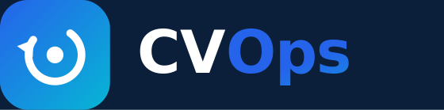
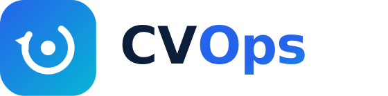
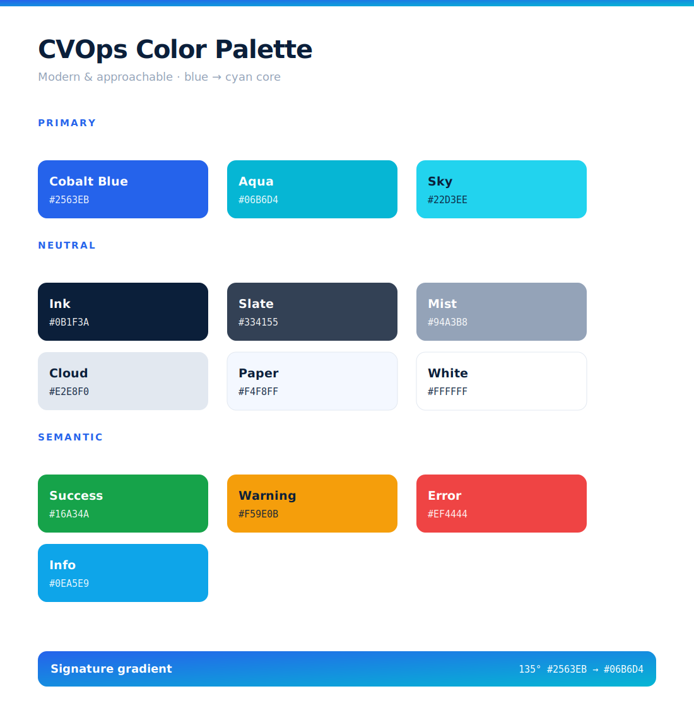

<div align="center">

<br><br>
<strong>Brand Assets — CVOps Design System</strong>
</div>

---

This folder contains every brand asset for CVOps: logos, icons, color tokens, illustrations, social banners, presentation assets, and the HTML brand guide. All SVG assets are **code-generated** via the Python scripts at the bottom of this page — regenerate any asset by re-running the corresponding script.

---

## Logos

| File | Preview | Use |
|---|---|---|
| `logo-primary-dark.svg` |  | Full wordmark — dark backgrounds |
| `logo-primary-light.svg` |  | Full wordmark — light backgrounds |
| `logo-mark-tile.svg` |  | Square app icon tile (48×48) |
| `logo-mark-glyph.svg` | — | Bare glyph, transparent background — inline use |

**Adaptive logo in HTML/Markdown (dark/light mode aware):**

```html
<picture>
  <source media="(prefers-color-scheme: dark)" srcset="brand/logo-primary-dark.svg">
  <source media="(prefers-color-scheme: light)" srcset="brand/logo-primary-light.svg">
  
</picture>
```

**Logo rules (from the brand guide):**
- Minimum width: 120px for the full wordmark, 32px for the mark tile
- Always place on a background from the CVOps palette — never over photos or busy patterns
- Do not recolor, stretch, or rearrange elements
- Maintain 24px clear space on all sides at minimum

---

## Icons & Favicons

All sizes generated from `icons/icon-master.svg` (512×512).

| File | Size | Platform |
|---|---|---|
| `icons/favicon.ico` | multi-res | Browser tabs, bookmarks |
| `icons/icon-16.png` | 16×16 | Favicon fallback |
| `icons/icon-32.png` | 32×32 | Favicon standard |
| `icons/icon-48.png` | 48×48 | Windows taskbar |
| `icons/icon-64.png` | 64×64 | General purpose |
| `icons/icon-128.png` | 128×128 | macOS Dock, large displays |
| `icons/icon-192.png` | 192×192 | Android home screen, PWA manifest |
| `icons/icon-256.png` | 256×256 | High-DPI display |
| `icons/icon-512.png` | 512×512 | PWA splash screen |
| `icons/apple-touch-icon-180.png` | 180×180 | iOS home screen |

**PWA manifest snippet:**

```json
{
  "icons": [
    { "src": "/icons/icon-192.png", "sizes": "192x192", "type": "image/png" },
    { "src": "/icons/icon-512.png", "sizes": "512x512", "type": "image/png" }
  ]
}
```

**HTML head snippet:**

```html
<link rel="icon" type="image/x-icon" href="/icons/favicon.ico">
<link rel="icon" type="image/png" sizes="32x32" href="/icons/icon-32.png">
<link rel="apple-touch-icon" sizes="180x180" href="/icons/apple-touch-icon-180.png">
```

---

## Colors

### Palette



### Tokens

| Token | Hex | Role |
|---|---|---|
| `--cv-cobalt-blue` | `#2563EB` | Primary action, links, gradient start |
| `--cv-aqua` | `#06B6D4` | Accent, gradient end |
| `--cv-sky` | `#22D3EE` | Highlight, hover states |
| `--cv-ink` | `#0B1F3A` | Primary text, dark backgrounds |
| `--cv-slate` | `#334155` | Secondary text |
| `--cv-mist` | `#94A3B8` | Disabled, placeholder text |
| `--cv-cloud` | `#E2E8F0` | Borders, dividers |
| `--cv-paper` | `#F4F8FF` | Page background |
| `--cv-white` | `#FFFFFF` | Surface, card backgrounds |
| `--cv-success` | `#16A34A` | Success states |
| `--cv-warning` | `#F59E0B` | Warning states |
| `--cv-error` | `#EF4444` | Error states |
| `--cv-info` | `#0EA5E9` | Info states |
| `--cv-gradient` | `linear-gradient(135deg, #2563EB 0%, #06B6D4 100%)` | Brand gradient |

**CSS variables** — import `cvops-colors.css` into any web project:

```css
@import 'brand/cvops-colors.css';

.my-button {
  background: var(--cv-gradient);
  color: var(--cv-white);
}
```

**JSON tokens** — import `cvops-colors.json` into design tools (Figma tokens, Style Dictionary, etc.):

```json
{
  "primary": {
    "cobalt-blue": "#2563EB",
    "aqua": "#06B6D4",
    "sky": "#22D3EE"
  }
}
```

---

## Typography

| Typeface | Weight | Use |
|---|---|---|
| **Inter** | 400, 500, 600, 700, 800 | UI text, headings, body copy |
| **JetBrains Mono** | 500 | Code, IDs, hash values, metrics |

```html
<link rel="preconnect" href="https://fonts.googleapis.com">
<link href="https://fonts.googleapis.com/css2?family=Inter:wght@400;500;600;700;800&family=JetBrains+Mono:wght@500&display=swap" rel="stylesheet">
```

---

## Illustrations

| File | Dimensions | Use |
|---|---|---|
| `hero-orbit.svg` | 900×560 | Hero section, README header, "How it works" diagram |
| `graphic-dashboard.svg` | 900×560 | Dashboard preview, product screenshots, docs |

**Embed in Markdown:**

```markdown


```

**Embed in HTML (responsive):**

```html

```

The `hero-orbit.svg` shows the five lifecycle nodes (Datasets, Models, Workflows, Audit, Versioning) arranged around a central CVOps hub — use it anywhere you need to explain the product concept visually.

---

## Social & Promotional Banners

| File | Dimensions | Platform |
|---|---|---|
| `social-banner-og.svg` / `.png` | 1200×630 | Open Graph meta tag, Twitter card, link previews |
| `social-banner-wide.svg` / `.png` | 1500×500 | X (Twitter) header, LinkedIn banner |

**Open Graph meta tags:**

```html
<meta property="og:image" content="https://your-domain.com/brand/social-banner-og.png">
<meta property="og:image:width" content="1200">
<meta property="og:image:height" content="630">
<meta name="twitter:card" content="summary_large_image">
<meta name="twitter:image" content="https://your-domain.com/brand/social-banner-og.png">
```

> Always use the `.png` versions for Open Graph — some crawlers do not render SVG.

---

## Presentation Assets

| File | Dimensions | Use |
|---|---|---|
| `pitch-title-slide.svg` / `.png` | 1920×1080 | Pitch deck title slide, 16:9 presentations |

Import `pitch-title-slide.png` directly into Google Slides, PowerPoint, or Keynote as a background image on the first slide.

---

## Brand Guide

`CVOps-Brand-Guide.html` is a self-contained interactive HTML document covering:

- Brand essence and positioning
- Logo usage: correct usage, do's and don'ts, clear space rules
- Full color system with swatches
- Typography scale and usage
- Imagery guidelines
- Voice and tone

Open it directly in a browser — no server required:

```bash
open brand/CVOps-Brand-Guide.html          # macOS
start brand/CVOps-Brand-Guide.html         # Windows
xdg-open brand/CVOps-Brand-Guide.html      # Linux
```

---

## Generator Scripts

All assets are produced by Python scripts. Re-run any script to regenerate its outputs.

| Script | Generates |
|---|---|
| `gen_brand.py` | Logo SVGs: `logo-mark-tile.svg`, `logo-mark-glyph.svg`, `logo-primary-dark.svg`, `logo-primary-light.svg` |
| `gen_assets.py` | Icon tiles, `social-banner-og.svg`, `social-banner-wide.svg`, `pitch-title-slide.svg`, `cvops-colors.svg`, `cvops-colors.json`, `cvops-colors.css` |
| `gen_imagery.py` | `hero-orbit.svg`, `graphic-dashboard.svg` |
| `gen_guide.py` | `CVOps-Brand-Guide.html` |

```bash
cd brand
python gen_brand.py
python gen_assets.py
python gen_imagery.py
python gen_guide.py
```

---

## File Index

```
brand/
├── CVOps-Brand-Guide.html        ← Interactive HTML brand guide
├── CVOps-color-palette.svg       ← Visual color swatch sheet
├── cvops-colors.css              ← CSS custom properties (--cv-*)
├── cvops-colors.json             ← Design token JSON
├── graphic-dashboard.svg         ← Dashboard UI mockup illustration
├── graphic-dashboard_prev.png
├── hero-orbit.svg                ← Lifecycle hub diagram
├── hero-orbit_prev.png
├── logo-mark-glyph.svg           ← Bare glyph (transparent)
├── logo-mark-tile.svg            ← Square tile icon (48×48)
├── logo-mark-tile_prev.png
├── logo-primary-dark.svg         ← Full wordmark — dark backgrounds
├── logo-primary-dark_prev.png
├── logo-primary-light.svg        ← Full wordmark — light backgrounds
├── logo-primary-light_prev.png
├── pitch-title-slide.svg         ← 1920×1080 presentation title
├── pitch-title-slide.png
├── social-banner-og.svg          ← 1200×630 Open Graph banner
├── social-banner-og.png
├── social-banner-wide.svg        ← 1500×500 X/LinkedIn header
├── social-banner-wide.png
├── gen_assets.py                 ← Generator: icons, banners, colors
├── gen_brand.py                  ← Generator: logo variants
├── gen_guide.py                  ← Generator: HTML brand guide
├── gen_imagery.py                ← Generator: hero + dashboard SVGs
└── icons/
    ├── icon-master.svg           ← 512×512 source icon
    ├── favicon.ico
    ├── apple-touch-icon-180.png
    ├── icon-16.png
    ├── icon-32.png
    ├── icon-48.png
    ├── icon-64.png
    ├── icon-128.png
    ├── icon-192.png
    ├── icon-256.png
    └── icon-512.png
```
