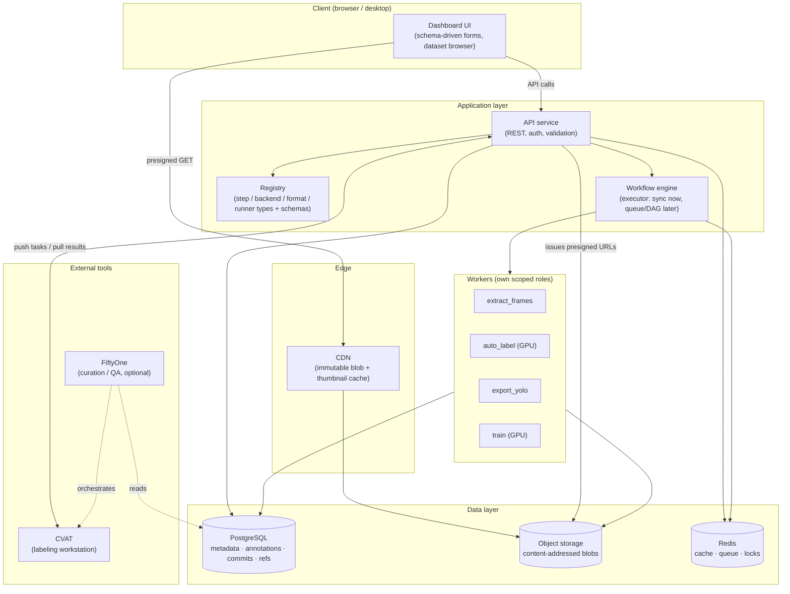

# 01 · Principles & Architecture

← [Back to README](./README.md) · Next → [Data Model](./02-data-model.md)

This document defines the cross-cutting principles that everything else obeys, the layered architecture, and the build-vs-buy reasoning.

---

## 1. Cross-cutting principles

These are non-negotiable invariants. Every other design choice is downstream of them. When in doubt during implementation, return here.

### P1 — Separate the bytes from the facts
Large binary payloads (video, frames, model weights, exports) and small structured facts (which frames exist, what the boxes are, which version contains what) have **opposite** characteristics and live in **different stores**. The DB never holds image bytes; object storage never answers a query. This is the root of both performance and clarity. See [Storage](./04-storage-performance-access.md).

### P2 — Immutability by default
A thing that never changes cannot be corrupted, cannot conflict, and can be cached forever. Blobs (content-addressed), dataset commits, annotation revisions, and tags are all immutable. We *add* new versions; we never mutate old ones.

### P3 — Append-only writes; pointers are the only mutable state
Edits create new immutable records. The only things that change in place are a small set of **named pointers** (branch heads, a project's "current" dataset ref). This is what makes concurrency safe with a tiny locking surface. See [Versioning](./03-versioning-concurrency-merge.md).

### P4 — Content-addressing everywhere bytes live
Every blob is keyed by the hash of its content. Consequences: automatic dedup across projects/versions, immutability for free, and **caching that needs no invalidation** (a hash's content never changes). One `blobs` table is reused by images, models, exports, and thumbnails alike.

### P5 — Everything pluggable is `type` + JSON Schema + registry
Steps, storage backends, label formats, model runners, and exporters all register under a `type` with a JSON Schema for their config, stored as validated JSONB. This one pattern simultaneously delivers modularity, validation (a control), and an auto-generated UI. See [Modularity](./06-modularity-and-extensibility.md).

### P6 — Nothing in a flow is hidden from the user
Every step, its config, its inputs, its outputs, its logs, and its state are **first-class, inspectable, and (where it makes sense) editable** through the API and dashboard. There is no privileged internal behavior the user can't see or reconfigure. P5 is what makes P6 cheap: if a capability is registered with a schema, the UI can already render and drive it. See [API & Dashboard UX](./07-api-and-dashboard-ux.md).

### P7 — Artifacts in, artifacts out
Every unit of work consumes versioned artifacts and produces versioned artifacts. Frame extraction: video → images. Auto-labeling: images + model → annotations. Export: dataset version → YOLO directory. Training: dataset version → model. Uniform contracts let the workflow engine wire arbitrary steps and let us reason about lineage. See [Workflow Engine](./05-workflow-engine.md).

### P8 — Reproducibility is a first-class output
For any model we must be able to answer "what produced this?" — exact dataset commit + code version + hyperparameters + environment + seed. A model record references the exact commit it trained on. Versioning exists to serve this, not for its own sake.

### P9 — Least privilege at every boundary
The client never holds DB or object-store credentials. The API issues narrow, short-lived grants (presigned URLs, scoped tokens). Workers get their own scoped roles. See [Controls & Security](./08-controls-governance-security.md).

---

## 2. Layered architecture

**Layer responsibilities:**

- **Client** — renders forms from registry schemas, browses datasets via metadata queries, and pulls image bytes *directly* from the CDN/object store (never through the API).
- **API service** — the only holder of DB/storage credentials. Authn/authz, validation against schemas, issuing presigned URLs, recording audit events. Stateless and horizontally scalable.
- **Registry** — the catalog of pluggable types and their schemas. Read by the engine (to execute) and the API (to expose to the UI).
- **Workflow engine** — turns a workflow definition (data) into a run; dispatches step executions. Starts as a synchronous in-process runner (Itai), evolves to a queue/DAG without changing the step contract.
- **Workers** — execute step implementations. GPU workers for `auto_label`/`train`. They read/write blobs directly to object storage and write facts to Postgres; they do not pass big bytes through the API.
- **Data layer** — Postgres (facts), object storage (bytes), Redis (cache, job queue, advisory locks).
- **External tools** — CVAT for human labeling, FiftyOne (optional) for curation. Neither is a source of truth; both are integrated through their APIs.

---

## 3. Build vs. buy

We build the **substrate** (data model, versioning, orchestration, API) because that is exactly what no off-the-shelf tool gives us in a way we control. We **buy/adopt** for the well-solved, high-effort pieces.

### CVAT vs. FiftyOne — they are not competitors
- **CVAT** is the *annotation editor*: humans draw and correct boxes, with model-assisted pre-labeling and per-job assignment. This is the natural home for the **review/correction** stage.
- **FiftyOne** is the *curation/QA layer*: query and visualize a dataset, compare predictions to ground truth, find label mistakes, compute mAP, surface hard examples — and it can *orchestrate* CVAT (send a filtered slice out for re-labeling, pull results back).

**Decision:** Use **CVAT** for labeling. Treat it strictly as a *labeling workstation* — our system is the source of truth; we push tasks via the CVAT API and ingest completed jobs back as new **annotation revisions** (see [Data Model](./02-data-model.md)). Adopt **FiftyOne** later (or as an optional power-user view) for curation/QA; it is not on the MVP critical path if the dashboard covers basic grid browsing and stats.

> Integration boundary to respect: never let CVAT's internal project/task model become the authoritative dataset. Sync is one-directional for truth (we own it) and request/response for work (we lease slices to CVAT). See sync mechanics in [Controls & Governance](./08-controls-governance-security.md#cvat-sync).

### Why not make DVC the core
DVC is excellent when the workflow is git-centric and CLI-first and you want pipeline reproducibility pinned to git commits. It is the wrong **core** for a multi-writer dashboard because:
- It can't answer queries like "all samples in version X with class `car` that were auto-labeled but not human-reviewed." A DB can.
- It has no concept of fine-grained, append-only annotation revisions with provenance and review state.
- It is not a live, concurrent, multi-service source of truth.

**Decision:** DB-native versioning is the core (immutable commit manifests in Postgres + content-addressed blobs). DVC is optional and narrow: when we *freeze* a version for training, we may snapshot it alongside the training code repo for end-to-end reproducibility. If blob-level, branchable versioning at very large scale becomes a real requirement, evaluate **lakeFS** (git-like semantics over object storage) rather than retrofitting DVC.

---

## 4. Technology choices (rationale, not religion)

| Layer | Choice | Rationale | Swappable? |
|---|---|---|---|
| Metadata DB | PostgreSQL | Transactions, rich indexing, JSONB for typed config, mature | Hard to swap; chosen deliberately |
| Blob store | S3-compatible (MinIO on-prem / S3 / GCS) | Presigned URLs, lifecycle policies, CDN-friendly, standard | Yes — behind a `StorageBackend` interface (see [Modularity](./06-modularity-and-extensibility.md)) |
| Cache / queue / locks | Redis | One dependency for three needs early on | Queue can later move to a dedicated broker |
| Annotation UI | CVAT | Best open-source box editor + model assist | Yes — behind a `LabelingBackend` interface |
| Orchestration | Custom engine, sync → queue → DAG | Keep the step contract; grow the executor | Executor swappable; contract fixed |

The "swappable" column is not aspiration — it is enforced by the registry/interface pattern in [Modularity & Extensibility](./06-modularity-and-extensibility.md). Choosing a concrete tool today does not lock the architecture to it.
