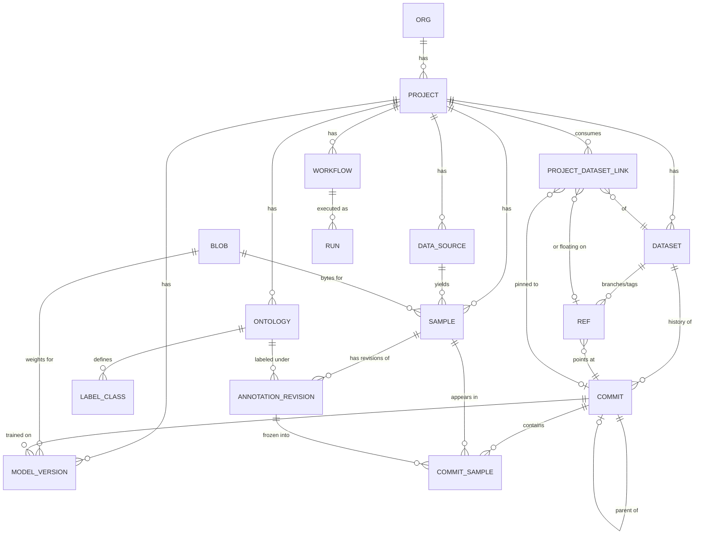

# 02 · Data Model

← [Principles & Architecture](./01-principles-and-architecture.md) · Next → [Versioning, Concurrency & Merge](./03-versioning-concurrency-merge.md)

This is the heart of Yehuda's work. It defines the entities, the **generic/global building blocks** that are reused everywhere in the code, and a concrete schema sketch. (Sketch, not DDL — we are still in design.)

---

## 1. The generic building blocks (reused across the whole codebase)

Before the domain tables, four primitives recur everywhere. Designing them once, generically, is what keeps the system small and consistent. **Treat these as the toolbox every feature reaches into.**

### G1 — The base entity (mixin)
Every row of every table carries the same spine:

| Column | Meaning |
|---|---|
| `id` | UUID primary key (generated app-side; stable, shardable) |
| `created_at`, `updated_at` | timestamps |
| `created_by` | actor (user/service) — feeds audit & lineage |
| `deleted_at` | soft-delete tombstone (NULL = live) |
| `org_id` / `project_id` | tenancy scope (where applicable) |

Implemented once as a base model / mixin and inherited by all domain models. Soft-delete is the default; hard deletes are a deliberate, audited GC operation (see [Versioning §GC](./03-versioning-concurrency-merge.md#garbage-collection)).

### G2 — The blob (the one content-addressed store)
The single most reused primitive. **One table** backs images, model weights, exports, thumbnails, logs — anything that is "a pile of bytes."

| Column | Meaning |
|---|---|
| `hash` | content hash (e.g. `sha256:...`), **primary key** |
| `storage_backend` | which backend holds it (`s3`, `minio`, ...) |
| `storage_key` | key/path within that backend |
| `size_bytes`, `media_type` | metadata |
| `created_at` | first time we saw these bytes |

Because the key *is* the content hash: identical bytes upload once (idempotent), are immutable, and are cacheable forever. Domain tables reference `blob.hash`; they never store bytes. See [Storage](./04-storage-performance-access.md).

> **The "everything is an artifact" view.** Conceptually, an *artifact* = a typed reference to a blob (`type` ∈ {image, model, export, thumbnail, log, ...} + `metadata` JSONB + `blob_hash`). You can model this as an explicit `artifacts` table, or let specific domain tables (samples, model_versions, exports) reference `blob.hash` directly. Start with direct references for clarity; promote to an explicit `artifacts` table only if a generic "browse any artifact" surface is needed. Either way, P7 ("artifacts in, artifacts out") is the mental model the workflow engine uses.

### G3 — Typed config + JSON Schema (`type_schemas`)
Anything configurable (a step, an exporter, a model runner) is described by a registered **JSON Schema**. Config values are stored as **JSONB validated against that schema** at write time. This is the generic pattern that powers modularity, validation, and auto-generated UI all at once (principles P5/P6).

| `type_schemas` column | Meaning |
|---|---|
| `type_key` | e.g. `step.extract_frames`, `exporter.yolo`, `backend.s3` |
| `category` | `step` / `exporter` / `backend` / `model_runner` / ... |
| `json_schema` | the JSON Schema (params, types, defaults, constraints) |
| `version` | schema version (configs record which they were written against) |
| `ui_hints` | optional rendering hints (widget, ordering, groups) |

Schemas can live in code and be *published* into this table, or be authored here directly. The API serves them to the UI; the engine validates against them before running. See [Modularity](./06-modularity-and-extensibility.md).

### G4 — The generic run + the generic event log
Two append-only tables that the entire system writes into:

- **`runs`** — *any* asynchronous unit of work shares one shape: `id`, `kind` (`workflow` / `step` / `extraction` / `inference` / `train` / `export`), `parent_run_id`, `status` (state machine), `input_refs` JSONB, `output_refs` JSONB, `config` JSONB, `metrics` JSONB, `logs_blob_hash`, `attempt`, `error`, timestamps. Reused by every step type rather than a bespoke table per operation. See the state machine in [Workflow Engine](./05-workflow-engine.md#run-state-machine).
- **`events` (audit log)** — append-only: `id`, `actor`, `entity_type`, `entity_id`, `action`, `payload` JSONB, `created_at`. The backbone of provenance, lineage, and the activity feed. *Every* meaningful mutation emits one. See [Controls & Governance](./08-controls-governance-security.md#audit--lineage).

These four (G1–G4) are why new features rarely need new infrastructure: they reuse the base entity, the blob store, the schema/config pattern, and the run/event pair.

---

## 2. Domain entities



### Projects & sources
- **`org`**, **`project`** — tenancy + the unit of ownership. A project pins a `task_type` (detection today), a default ontology, and `settings` JSONB.
- **`data_source`** — a raw input: a video or an image folder. References the source `blob.hash` (or an external URI for streamed/remote sources) + `metadata` (fps, duration, codec...).

### Samples (images) — the atom
- **`sample`** — one image. Columns: `project_id`, `blob_hash` → BLOB, `source_id` → DATA_SOURCE, `width`, `height`, `frame_index` (for video-derived frames), `perceptual_hash` (near-duplicate detection), `metadata` JSONB.
- A sample is **immutable** once created (the bytes are fixed). New crops/derivatives are new samples.

### Ontology & classes (a shared, versioned resource)
- **`ontology`** — a versioned set of classes for a project (or shared across projects). Has a `version`.
- **`label_class`** — `ontology_id`, **`class_key`** (a *stable string* id, e.g. `vehicle.car`), `display_name`, `color`, `order`.

> **Why a stable `class_key` and not a raw integer id:** YOLO's on-disk `class_id` is *positional* and fragile — reordering or inserting a class silently corrupts every label file. We store the durable `class_key` internally and **derive the integer `class_id` only at export time** from the order within a *published* ontology version. Adding/reordering classes never rewrites stored annotations; it only changes the generated `data.yaml`. See [Storage §YOLO export](./04-storage-performance-access.md) and the ontology-evolution discussion in [Gaps](./09-gaps-and-considerations.md#ontology-evolution).

### Annotations (append-only, with provenance)
- **`annotation_revision`** — append-only; **never updated in place**. Columns: `sample_id`, `ontology_version`, `revision_no`, `parent_revision_id`, `payload` JSONB, `provenance` JSONB, `created_by`, `created_at`.
  - `payload` is a list of objects in a **canonical internal geometry** (not YOLO): each object = `{ class_key, geometry, attributes, confidence, track_id? }`. `geometry` is general enough to hold a bbox today and a polygon/keypoints/oriented-box tomorrow (see [Gaps §annotation types](./09-gaps-and-considerations.md#annotation-types-beyond-boxes)).
  - `provenance` records *who/what* produced this revision: `source` ∈ {model, human, import, merge}, plus `model_version_id` (which model auto-labeled it) or `author_user_id`, and a `review_status` (e.g. `unreviewed` / `accepted` / `rejected`).
- There is **no single mutable "current annotation"** column. "Current" is whatever revision a given branch/commit points to. An editor working on a branch produces new revisions; freezing a commit captures the exact revision per sample.

### Datasets & versioning (full detail in [doc 03](./03-versioning-concurrency-merge.md))
- **`dataset`** — a named, evolving collection within a project.
- **`commit`** — an **immutable** snapshot: `dataset_id`, `parent_commit_id` (one or two for merges), `ontology_version`, `message`, `author`, `created_at`, `stats` JSONB (cached counts — safe to cache forever because the commit is immutable).
- **`commit_sample`** — the **materialized membership** of a commit: `commit_id`, `sample_id`, `annotation_revision_id`, `split` ∈ {train, val, test}. Indexed by `(commit_id, split)` and `(commit_id, class_key)` derivations. This join table is what lets us **SQL-filter inside a version** without touching bytes.
  - *Scale note:* at very large scale you can additionally pack the manifest into a content-addressed blob and keep `commit_sample` as a derived index. Start with the table; see [Gaps §scale](./09-gaps-and-considerations.md#scale--very-large-datasets).
- **`ref`** — the generic pointer system: `dataset_id`, `ref_type` ∈ {branch, tag}, `name`, `target_commit_id`, `is_mutable`. Branch = mutable head (CAS-updated); tag = immutable label. The same pointer pattern can later version ontologies and workflow definitions.
- **`project_dataset_link`** — **how a project consumes a dataset**: `project_id`, `dataset_id`, and *either* `pinned_commit_id` (immutable, reproducible) *or* `ref_id` (floating, tracks latest). This row is the answer to "multiple projects using the same dataset without conflict" — see [doc 03](./03-versioning-concurrency-merge.md#multiple-projects-no-conflict).

### Models & training
- **`model_version`** — `project_id`, `blob_hash` → weights, **`trained_on_commit_id`** → COMMIT, `base_model`, `hyperparams` JSONB, `metrics` JSONB, `code_version`, `env_hash`, `seed`, `created_at`. The `trained_on_commit_id` link is the reproducibility payoff (P8): every model knows the exact data that made it.

### Workflows & runs (full detail in [doc 05](./05-workflow-engine.md))
- **`workflow`** — `project_id`, `name`, **`definition` JSONB** (steps + edges), `version`. Workflows are *data*, and are themselves versioned.
- **`run`** / **`step_run`** — the generic run rows from G4: a `workflow` run owns child `step` runs; each step run carries its `input_refs`, `output_refs`, validated `config`, status, logs, metrics.

---

## 3. Schema sketch (reference)

> Columns abbreviated; every table also carries the G1 base spine. PK = primary key, FK = foreign key. This is the design target, not final DDL.

```
blobs(hash PK, storage_backend, storage_key, size_bytes, media_type)
type_schemas(type_key PK, category, json_schema JSONB, version, ui_hints JSONB)
events(id PK, actor, entity_type, entity_id, action, payload JSONB, created_at)

orgs(id PK, name)
users(id PK, email, ...)
memberships(org_id FK, user_id FK, role)             -- RBAC, see doc 08
projects(id PK, org_id FK, name, task_type, default_ontology_id FK, settings JSONB)

data_sources(id PK, project_id FK, type, blob_hash FK?, external_uri?, metadata JSONB)
samples(id PK, project_id FK, blob_hash FK, source_id FK, width, height,
        frame_index?, perceptual_hash, metadata JSONB)

ontologies(id PK, project_id FK?, name, version)
label_classes(id PK, ontology_id FK, class_key, display_name, color, "order")

annotation_revisions(id PK, sample_id FK, ontology_version, revision_no,
        parent_revision_id FK?, payload JSONB, provenance JSONB, created_by, created_at)

datasets(id PK, project_id FK, name)
commits(id PK, dataset_id FK, parent_commit_id FK?, second_parent_commit_id FK?,
        ontology_version, message, author, stats JSONB, created_at)
commit_samples(commit_id FK, sample_id FK, annotation_revision_id FK, split,
        PRIMARY KEY(commit_id, sample_id))
refs(id PK, dataset_id FK, ref_type, name, target_commit_id FK, is_mutable,
        UNIQUE(dataset_id, ref_type, name))
project_dataset_links(id PK, project_id FK, dataset_id FK,
        pinned_commit_id FK?, ref_id FK?)            -- exactly one of the two

model_versions(id PK, project_id FK, blob_hash FK, trained_on_commit_id FK,
        base_model, hyperparams JSONB, metrics JSONB, code_version, env_hash, seed)

workflows(id PK, project_id FK, name, definition JSONB, version)
runs(id PK, kind, parent_run_id FK?, project_id FK, workflow_id FK?, workflow_version?,
        status, input_refs JSONB, output_refs JSONB, config JSONB, metrics JSONB,
        logs_blob_hash FK?, attempt, error, started_at, finished_at)
```

### Index priorities (the hot paths)
- `commit_samples (commit_id)` and a derived index for `(commit_id, split)` — assembling a version.
- A way to filter a version by class and review status — either denormalize `class_key`/`review_status` onto `commit_samples`, or maintain a derived per-commit class index. (Commits are immutable, so these derived indexes never need invalidation.)
- `samples (project_id, perceptual_hash)` — near-duplicate detection on ingest.
- `refs (dataset_id, ref_type, name)` unique — fast head lookup + CAS target.
- `runs (workflow_id, status)` and `runs (parent_run_id)` — dashboard run views.
- `events (entity_type, entity_id, created_at)` — lineage/history of any entity.

---

## 4. Why this model satisfies the requirements

- **Edits & saving** — append-only `annotation_revisions` + immutable `commits`; "saving" is adding rows and moving a small `ref`. ([doc 03](./03-versioning-concurrency-merge.md))
- **Many projects on many commits, no conflict** — `project_dataset_links` lets each project pin a commit or follow a branch independently over the same immutable `dataset`. ([doc 03](./03-versioning-concurrency-merge.md#multiple-projects-no-conflict))
- **Fast** — facts are tiny rows in Postgres; bytes are out in object storage; versions are assembled and filtered by query alone. ([doc 04](./04-storage-performance-access.md))
- **Generic & reusable** — G1–G4 (base entity, blob store, schema/config, run/event) are the toolbox; domain tables are thin specializations. ([doc 06](./06-modularity-and-extensibility.md))
- **Opened to the user** — `type_schemas` + the run/event rows mean every configurable thing and every execution is inspectable and drivable from the UI. ([doc 07](./07-api-and-dashboard-ux.md))
