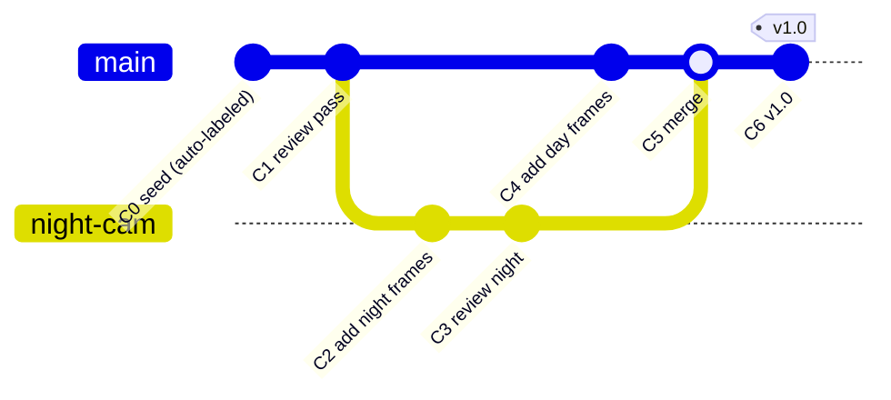
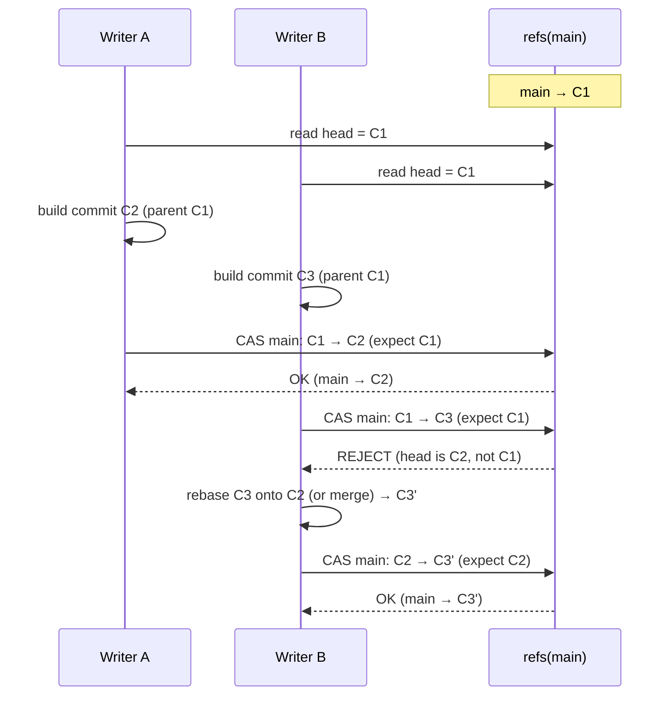
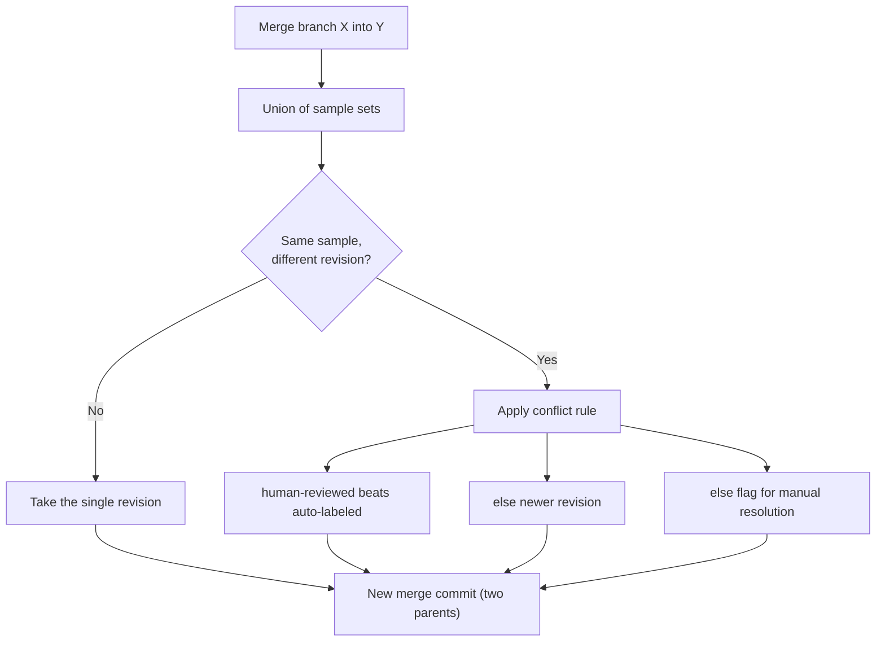
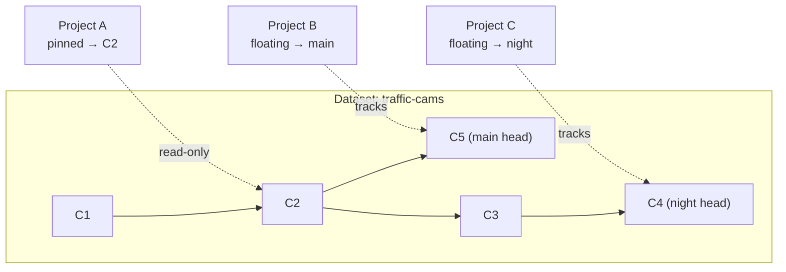

# 03 · Versioning, Concurrency & Merge

← [Data Model](./02-data-model.md) · Next → [Storage, Performance & Access](./04-storage-performance-access.md)

This document specifies the git-for-data model: how commits, branches, and tags behave; how concurrent writers stay conflict-free; how data is merged; and how many projects share one dataset safely. It is the operational detail behind principles **P2/P3** (immutability, append-only) from [doc 01](./01-principles-and-architecture.md).

---

## 1. The mental model

Three object kinds, borrowed directly from git:

| Object | Mutable? | Role |
|---|---|---|
| **Commit** | No (immutable) | A frozen snapshot: the manifest of `(sample → annotation_revision, split)` + ontology version + parent(s). |
| **Branch** | Yes (a pointer) | A *moving* head that points at the latest commit on a line of work (`main`, `experiment-night-cam`). |
| **Tag** | No (a fixed pointer) | A permanent name for one commit (`v1.0`, `train-run-42`). |

**The core guarantee:** *conflicts only exist where something mutates.* Commits never mutate, so any number of readers can hold the same commit forever with zero coordination. The only mutable surface in the entire versioning system is the set of branch heads — and writes to those are serialized by a single compare-and-swap.

---

## 2. How "saving" works (the lifecycle)

Everything below is **append rows + move one pointer**. Nothing is overwritten.

1. **Save bytes (a frame, a model).** Hash the bytes → check `blobs` for the hash → if absent, upload to object storage and insert the `blobs` row. Idempotent: re-saving identical bytes is a no-op. (See [Storage](./04-storage-performance-access.md).)
2. **Save an annotation edit.** Insert a **new** `annotation_revision` (with `parent_revision_id` set, `provenance` recorded). The old revision is untouched — full history survives (model produced → human moved a box → human deleted a box).
3. **Commit a dataset state.** Insert a `commit` row with `parent_commit_id = <current branch head>`; insert the `commit_sample` rows capturing the exact `annotation_revision_id` and `split` per sample; then **advance the branch** (the CAS in §3).
4. **Tag a version.** Insert an immutable `ref` of type `tag` pointing at a commit. This is what training pins to.

> Because step 3 captures explicit revision ids, a commit is a perfect time-machine: re-open `v1.0` years later and you get byte-identical images and the exact boxes as they were.

---

## 3. Concurrency: optimistic, lock-free, conflict-explicit

We do **not** lock a dataset while someone edits it. We use **optimistic concurrency** on the branch head — the same fast-forward logic git uses, implemented as a compare-and-swap on the `refs` row.

- The CAS is `UPDATE refs SET target_commit_id = :new WHERE id = :ref AND target_commit_id = :expected_parent`. If it updates 0 rows, someone moved the head first; the writer **rebases or merges** and retries.
- **No lost updates** (the loser is forced to reconcile), **no global lock** (readers and other-branch writers are unaffected), and **conflicts surface explicitly** instead of silently clobbering.
- This applies to *structural* writes (commits). Concurrent **annotation editing** of individual samples is handled at a finer grain: CVAT assigns a labeling **job** to a single annotator (so two people don't edit the same image at once), and we ingest completed jobs as revisions; the commit step then serializes them. See [CVAT sync](./08-controls-governance-security.md#cvat-sync).

---

## 4. Merging & integrating data

"Combine these datasets / branches" decomposes into a few well-defined operations:

### Adding new samples (the common case — additive, never conflicts)
Append `sample` rows, then a new commit whose `commit_sample` set is the old set ∪ the new samples. Pure union. (Content-addressing means re-ingesting a video you already have adds *no* duplicate blobs.)

### Editing annotations
Produces new `annotation_revisions`; the new commit points at them for the affected samples and keeps the old revisions for the rest. No mutation, so no conflict at the storage layer.

### Merging two branches
Because samples are content-addressed and identified by id, a merge is **mostly a set union** of `commit_sample` rows:
- **Sample present on one side only** → include it. (No conflict.)
- **Sample present on both, same `annotation_revision_id`** → include it once. (No conflict.)
- **Sample present on both, *different* revisions** → **this is the only real conflict**, at `(sample, annotation)` granularity.

Conflict resolution is a **policy**, chosen per merge (and itself a registered, schema-described option — see [Modularity](./06-modularity-and-extensibility.md)): e.g. *prefer human over model*, *prefer newer*, or *halt and list conflicts for a human to resolve in the UI*. Conflicts are rare because the dominant operations are additive unions.

> **Cross-ontology merges** (combining datasets labeled under different class sets) need a class mapping step first. That's a known sharp edge — see [Gaps §ontology evolution](./09-gaps-and-considerations.md#ontology-evolution).

---

## 5. Multiple projects, no conflict {#multiple-projects-no-conflict}

This is the requirement Yehuda raised directly. The model answers it cleanly.

A project does **not own** a dataset — it holds a **reference** via `project_dataset_link`:

- **Pinned to a commit** (`pinned_commit_id`) → immutable, reproducible. The project always sees exactly that snapshot. Two projects pinned to the same commit *cannot* conflict — the commit is read-only and never changes underneath either of them.
- **Floating on a branch** (`ref_id`) → the project tracks the latest commit on that branch. It sees new work as the branch advances.

- **Project A** trains reproducibly against the frozen `C2`. New commits don't disturb it.
- **Project B** follows `main` and picks up `C5` automatically.
- **Project C** is exploring a different line on the `night` branch — fully independent.

None of them can corrupt another's view, because **the only shared objects are immutable commits**, and each project's *choice of what to look at* is its own private pointer. If two projects want to evolve the data differently, they branch; branches are independent by construction (§4).

---

## 6. Garbage collection {#garbage-collection}

Append-only + immutability means storage grows. GC reclaims it safely:

- **Reachability.** A commit is *reachable* if any `ref` (branch/tag) or `project_dataset_link` can reach it through the parent graph. Unreachable commits are GC candidates — exactly git's mark-and-sweep.
- **Blob reference counting.** A blob is deletable only when no *reachable* `sample`/`model_version`/`export`/`thumbnail` references it. Track refcounts (or recompute via mark-and-sweep) before any hard delete.
- **Soft delete first.** Deletes set `deleted_at`; a separate, audited, slow sweep performs hard deletion after a retention window. This prevents "I deleted a branch and lost the data another project pinned."
- **Protected pins.** A commit referenced by any `project_dataset_link.pinned_commit_id` is never collectable, even if its branch is gone — this is what makes pinning a real reproducibility guarantee.

GC is a background job (a `run` of kind `gc`), fully audited via `events`. See retention policy in [Controls & Governance](./08-controls-governance-security.md).
