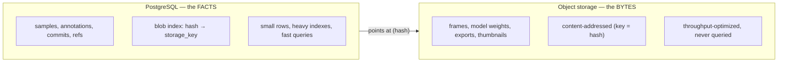
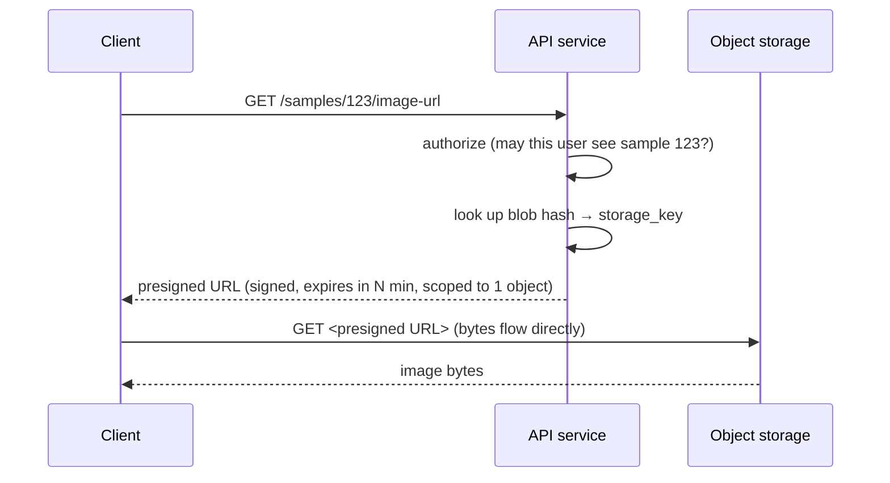

# 04 · Storage, Performance & Access

← [Versioning, Concurrency & Merge](./03-versioning-concurrency-merge.md) · Next → [Workflow Engine](./05-workflow-engine.md)

This document covers the data/metadata split, how large data is served **without** filling the app server, the caching strategy, and the YOLO export path. It is the operational detail behind principles **P1/P4/P9** ([doc 01](./01-principles-and-architecture.md)).

---

## 1. Two stores, opposite jobs



- **Postgres holds only facts** — never a single image byte. It stays small, its indexes stay in memory, and queries stay fast.
- **Object storage holds only bytes**, keyed by content hash. It is never asked a question more complex than "give me the object at this key."
- The link between them is a pointer: a `blobs` row maps `hash → (backend, storage_key)`.

**Why this is the performance foundation:** assembling and filtering a dataset version — *"all samples in commit X, split=train, with class `car`, review_status=accepted"* — is a query over tiny rows in `commit_samples`/`annotation_revisions`. **Zero image bytes are read.** You can count, page, and curate millions of images at query speed. Bytes are fetched lazily, only for the handful of images actually on screen, and they come straight from the object store/CDN — never through the API. (See [Data Model §index priorities](./02-data-model.md#index-priorities-the-hot-paths).)

---

## 2. Serving large data without touching the app server

### The anti-pattern we avoid
If the client fetched an image *through* the API, the path would be: object store → API memory/disk → client. That **doubles bandwidth**, **fills the server's disk/RAM**, and **does not scale**.

### The pattern: presigned URLs


- The API only ever returns a **short-lived, single-object, signed URL**. Authorization still happens (we sign a URL *only* for objects the caller may access, and it expires), but the **bytes never traverse the app server**.
- **Uploads** are the mirror image: the API returns a **presigned PUT** (or multipart-upload URLs for large files) and the client uploads *directly* to the store. The API records the resulting `blobs` row after the upload completes (verifying the hash). This keeps ingestion of large videos off the server entirely.
- Supported natively by S3 / MinIO / GCS — this is the standard, safe approach.

### Bulk access for training
A training job needs the whole frozen version, which may be far larger than any one machine's disk:
- **Preferred:** the export step materializes a YOLO layout to an object-storage prefix; the GPU machine reads directly from object storage using **its own scoped role** (not the dashboard, not presigned-through-the-API). See [Controls §least privilege](./08-controls-governance-security.md#least-privilege).
- **Streaming alternative:** the data loader fetches blobs **by hash on demand** with a local disk cache, so the full dataset never needs to sit on one disk at once.
- **Reproducible-snapshot alternative:** for a frozen `tag`, optionally push a DVC/lakeFS snapshot beside the training code (the narrow DVC role from [doc 01 §3](./01-principles-and-architecture.md#3-build-vs-buy)).

---

## 3. Caching — and why content-addressing makes it free

The key insight: **a content hash's bytes never change, so anything keyed by a hash can be cached forever with no invalidation logic.** That correctness-for-free applies at every layer:

| Layer | What's cached | Invalidation |
|---|---|---|
| **Browser** | full-res images & thumbnails (hash-named) | none — `Cache-Control: immutable, max-age=1y` |
| **CDN** (in front of object storage) | the same blobs, served at the edge | none — immutable by hash |
| **Redis** | immutable commit manifests + cached `stats` | none — commits never change |
| **Worker / trainer local disk** | blobs by hash | none — reuse across runs |

### Thumbnails are mandatory for the dashboard
Grid/browse views must **never** load full-resolution images. On ingest (or lazily on first request), generate downscaled **thumbnails**, store them as their own content-addressed blobs, and serve those in grids. Small, cacheable, and they keep the browser fast over thousands of samples.

### The presigned-URL ↔ CDN tension (and the resolution)
A naive presigned URL carries a signature in its query string that changes per request, which defeats CDN/browser caching. Resolutions, pick per asset class:
- **Thumbnails / low-sensitivity assets:** serve via a CDN with **origin access** (the CDN authenticates to the bucket; clients hit stable, cacheable URLs) — optionally gated by **CDN signed cookies** scoped to a project, so one authorization covers many cacheable objects.
- **Full-res / sensitive assets:** keep per-object presigned URLs (cache at the browser only, by the object, for the URL's lifetime).
- Either way, content-addressing means the *underlying* object is cacheable; the only question is how authorization is expressed at the edge.

---

## 4. The YOLO export path

YOLO format is an **export target, not the source of truth** (principle from [doc 02](./02-data-model.md#ontology--classes-a-shared-versioned-resource)). Export materializes a frozen commit into the on-disk layout YOLO trainers expect:

```
dataset/
  data.yaml                 # class names (from the ontology version) + split paths
  images/{train,val,test}/  # symlinks or copies of blobs, by sample
  labels/{train,val,test}/  # one .txt per image: class_id cx cy w h  (normalized)
```

- **`class_id` is derived at export time** from the order of the *published* ontology version — never stored. Reordering classes only regenerates `data.yaml`; stored annotations are untouched. (This is the whole reason for the stable `class_key`.)
- **Geometry conversion:** internal canonical geometry → YOLO-normalized `(cx, cy, w, h)` using the sample's stored `width`/`height`.
- **Splits come from `commit_sample.split`** — deterministic and reproducible, captured at commit time (see split-leakage warning in [Gaps](./09-gaps-and-considerations.md#split-leakage)).
- **Output is itself a content-addressed artifact** (an `export` blob/manifest), so re-exporting the same commit + same exporter config is idempotent and cacheable.

Export is a registered **exporter** type (`exporter.yolo`) so other formats (COCO, Pascal VOC) drop in later with no core change — see [Modularity](./06-modularity-and-extensibility.md).

---

## 5. Performance checklist

- **Index the hot paths** (commit assembly, class/review filters, ref head lookups, run lists) — see [doc 02](./02-data-model.md#index-priorities-the-hot-paths).
- **Precompute immutable stats.** Per-commit class counts / split sizes are computed once and cached (a `stats` JSONB on `commit`, or a summary table). Safe forever because the commit can't change.
- **Cursor pagination** for any large list (sample browser, run history). Never `OFFSET` deep into millions of rows.
- **Annotations as rows, not one giant JSON blob per dataset** — so reads/writes are incremental and queryable.
- **Stateless API, direct-to-storage bytes** — the API scales horizontally because it never holds large payloads.
- **Partitioning, later.** If a single project reaches tens of millions of samples, partition `samples`/`commit_samples` by project (or time) and consider an external search index for metadata. Flagged in [Gaps §scale](./09-gaps-and-considerations.md#scale--very-large-datasets).
- **Lifecycle policies on the bucket.** Move cold blobs (old exports, superseded model weights) to cheaper storage tiers; flagged in [Gaps §cost](./09-gaps-and-considerations.md#cost--storage-lifecycle).
