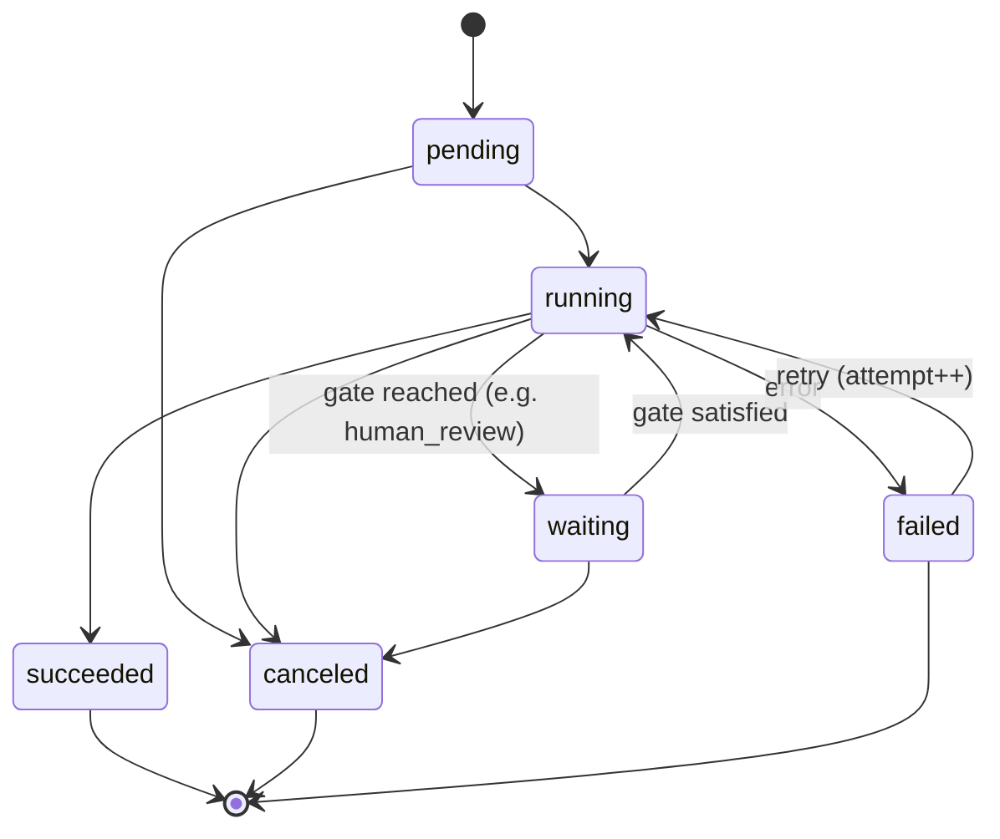
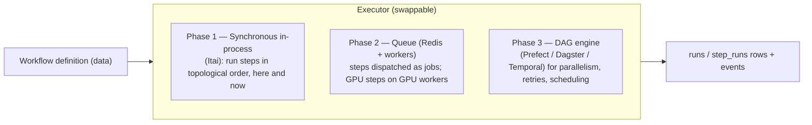

# 05 · Workflow Engine

← [Storage, Performance & Access](./04-storage-performance-access.md) · Next → [Modularity & Extensibility](./06-modularity-and-extensibility.md)

This document specifies how workflows are defined, validated, executed, and exposed. It realizes principles **P5/P6/P7** ([doc 01](./01-principles-and-architecture.md)). Itai's "synchronous sequence" is the first concrete executor here.

---

## 1. Workflows are data, not code

A workflow is a **JSON document** (`workflows.definition`), not a hardcoded function. It lists typed steps and the edges between them. The dashboard reads/writes this document; the engine interprets it. This is what makes workflows **user-composable and user-editable** (P6).

```jsonc
{
  "name": "night-cam intake v3",
  "steps": [
    { "id": "s1", "type": "extract_frames",
      "config": { "interval_seconds": 2, "max_frames": 5000 },
      "inputs": { "source": "$run.params.video_source" } },

    { "id": "s2", "type": "auto_label",
      "config": { "model_version_id": "mv_abc", "confidence_threshold": 0.35 },
      "inputs": { "images": "$steps.s1.outputs.images" } },

    { "id": "s3", "type": "human_review",        // a GATE: pauses for people
      "config": { "labeling_backend": "cvat", "assignees": ["..."] },
      "inputs": { "annotations": "$steps.s2.outputs.annotations" } },

    { "id": "s4", "type": "commit_dataset",
      "config": { "dataset": "traffic-cams", "branch": "night-cam",
                  "split_strategy": "by_source_group" },
      "inputs": { "samples": "$steps.s3.outputs.samples" } },

    { "id": "s5", "type": "export_yolo",
      "config": { "splits": { "train": 0.8, "val": 0.2 } },
      "inputs": { "commit": "$steps.s4.outputs.commit" } },

    { "id": "s6", "type": "train",
      "config": { "base_model": "yolo-n", "epochs": 100, "seed": 42 },
      "inputs": { "export": "$steps.s5.outputs.export" } }
  ],
  "edges": [["s1","s2"],["s2","s3"],["s3","s4"],["s4","s5"],["s5","s6"]]
}
```

- `type` resolves to a registered step (see [Modularity](./06-modularity-and-extensibility.md)).
- `config` is **validated against the step type's JSON Schema** before the run starts (a control — see [doc 08](./08-controls-governance-security.md#validation)).
- `inputs`/`outputs` are **artifact references** wired between steps via a small reference language (`$steps.<id>.outputs.<name>`, `$run.params.<name>`).
- Workflows are **versioned**; a run records `workflow_version` so old runs remain interpretable even after the workflow is edited.

---

## 2. The step contract (P7: artifacts in → artifacts out)

Every step — regardless of what it does — obeys one interface:

```
class Step:
    type_key: str                       # e.g. "extract_frames"
    config_schema: JSONSchema           # validated; also drives the UI form
    def plan(config, inputs) -> declared_outputs   # what it will produce (for DAG wiring/validation)
    def run(ctx, config, inputs) -> outputs        # do the work; return artifact refs
    # optional: is_gate (pauses for external/human input), resumable, idempotency_key(...)
```

- **Inputs and outputs are artifact references** (blob hashes, sample sets, commit ids, export ids) — never raw bytes passed in memory. A step reads bytes from object storage and writes results back, recording only references. This keeps steps composable and keeps big data off the engine.
- Because the contract is uniform, the engine can wire **any** step to any other, validate a graph before running it, and compute lineage automatically.
- This is exactly the seam where **Nati & Yahav** plug in: `extract_frames`, `auto_label`, `export_yolo` are three `Step` implementations. They never touch the engine, the DB schema, or each other — only the contract.

### Step types in the initial library
| Type | Consumes | Produces | Owner |
|---|---|---|---|
| `extract_frames` | data source (video) | samples (images) | Nati/Yahav |
| `auto_label` | samples + model_version | annotation_revisions (provenance=model) | Nati/Yahav |
| `human_review` *(gate)* | annotation_revisions | reviewed annotation_revisions | Yehuda (CVAT integration) |
| `commit_dataset` | samples + revisions | a commit on a branch | Yehuda |
| `export_yolo` | commit | export artifact | Nati/Yahav |
| `train` | export | model_version | Nati/Yahav |
| `evaluate` | model_version + commit | metrics | later |

---

## 3. Runs and the run state machine {#run-state-machine}

A **workflow run** is one execution of a workflow; it owns child **step runs**. Both are rows in the generic `runs` table ([doc 02 §G4](./02-data-model.md#g4--the-generic-run--the-generic-event-log)). Each carries `input_refs`, `output_refs`, validated `config`, `metrics`, `logs_blob_hash`, `attempt`, `error`.



- **`waiting`** is the human-in-the-loop state: a gate step (e.g. `human_review`) parks the run until the external condition is met (a CVAT job is completed and ingested). The run is not "stuck" — it's a durable, resumable pause.
- **Retries** increment `attempt` and reuse the same logical step; idempotency (below) makes retries safe.
- Every transition emits an `events` row → the dashboard's live run view and the audit trail come from the same source.

---

## 4. Executors: grow without changing the contract

The step contract is fixed; the **executor** that drives it evolves:



- **Phase 1 (now):** Itai's synchronous runner walks the steps in topological order and calls `run()` directly. Perfect for the first demo; correct against the contract.
- **Phase 2:** wrap each step dispatch as a Redis job; GPU-heavy steps (`auto_label`, `train`) land on GPU workers. No step code changes.
- **Phase 3:** if real DAG parallelism, scheduling, and backfills are needed, adopt a workflow engine — still no step code changes, because they already speak "artifacts in → artifacts out."

> Don't jump to Phase 3 early. The discipline is: get the *contract* right now, keep the executor boring, upgrade only when concurrency/scale demands it.

---

## 5. Idempotency, determinism, resumability

These make runs trustworthy and retries safe:

- **Idempotency keys.** A step's effect is keyed by `(step_type, config, input_refs)`. Re-running with the same key returns the existing output instead of duplicating work. Content-addressing makes this natural: extracting the same video at the same interval yields the same frame hashes; the second run is a no-op.
- **Determinism.** Steps that must be reproducible pin their inputs: `auto_label` records the exact `model_version_id` + preprocessing in provenance; `train` records `seed`, `code_version`, `env_hash`. (See reproducibility, [doc 02 model_version](./02-data-model.md#models--training) and [Gaps](./09-gaps-and-considerations.md#determinism-of-auto-labeling).)
- **Resumability.** Because each step's outputs are persisted as artifacts, a failed run resumes from the last completed step rather than restarting from scratch.

---

## 6. Everything in the flow is opened to the user (P6)

This is a hard requirement, and the design makes it almost automatic:

- **Every step type is discoverable** — the UI lists available steps from the registry and renders a config form from each step's JSON Schema. Adding a step type makes it appear in the builder with no UI work. ([Modularity](./06-modularity-and-extensibility.md), [API & UX](./07-api-and-dashboard-ux.md))
- **Every run is inspectable** — status, the exact `config` used, `input_refs`/`output_refs`, logs, metrics, and per-step timing, all from the `runs`/`events` rows.
- **Every flow is editable** — a workflow is data; users compose, clone, version, and re-run it. There is no hidden code path that does something the user can't see or change.
- **Every gate is actionable** — a `waiting` run shows the user exactly what it's waiting on (e.g. "42 CVAT jobs pending review") and links straight to the work.

The principle: *if the engine can do it, the user can see it, configure it, and drive it.*
