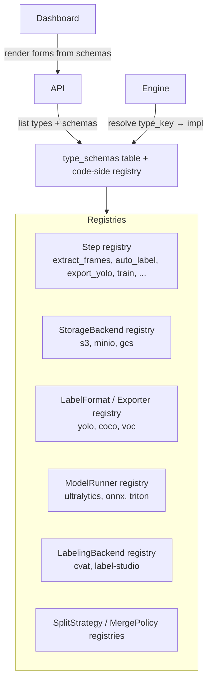
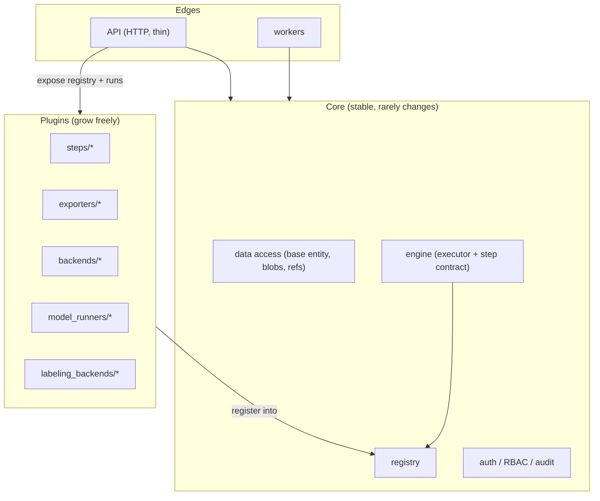

# 06 · Modularity & Extensibility

← [Workflow Engine](./05-workflow-engine.md) · Next → [API & Dashboard UX](./07-api-and-dashboard-ux.md)

This document is about keeping the system **modular and generic** so the same code serves many cases, and adding a capability never means surgery on the core. It directly answers Yehuda's request to "manage the DB with generic and global stuff so it's good to use in various places in the code."

Two mechanisms carry almost all of it: the **registry pattern** (for behavior) and the **generic DB patterns** (for data).

---

## 1. The registry pattern (pluggable behavior)

Every kind of pluggable thing lives in a **registry**: a central catalog mapping a `type_key` → (a JSON Schema for its config, an implementation). Core code never names a concrete implementation; it looks one up by key.

**What this buys (the same three things, again):**
1. **Modularity** — add a `type_key` + schema + implementation; change *no* core code. New exporter? Register `exporter.coco`. New storage? Register `backend.gcs`. The engine and UI pick it up automatically.
2. **Validation / control** — the schema is the gate; bad config is rejected before anything runs.
3. **Auto-generated UI** — the dashboard renders a config form straight from the schema, so new capabilities are immediately user-drivable (P6).

**Interfaces to define as registries (all swappable by design):**

| Interface | Purpose | Example impls |
|---|---|---|
| `Step` | a workflow operation | `extract_frames`, `auto_label`, `train` |
| `StorageBackend` | where blobs live | `s3`, `minio`, `gcs` |
| `Exporter` | dataset → on-disk format | `yolo`, `coco`, `voc` |
| `ModelRunner` | how inference/training runs | `ultralytics`, `onnx`, `triton` |
| `LabelingBackend` | the human annotation tool | `cvat`, `label-studio` |
| `SplitStrategy` | how train/val/test are assigned | `random_seeded`, `by_source_group` |
| `MergePolicy` | how annotation conflicts resolve | `human_over_model`, `newest`, `manual` |

Each is a small interface with a config schema. This is why [doc 01 §4](./01-principles-and-architecture.md#4-technology-choices-rationale-not-religion)'s "swappable" column is real and not aspirational.

### Adding a new capability — the recipe
1. Implement the interface (e.g. a new `Exporter`).
2. Register it with a `type_key` and a JSON Schema for its config.
3. Done. It appears in the workflow builder, validates its config, and is selectable in the UI. No migration, no engine change, no UI change.

---

## 2. Generic DB patterns (data reused everywhere)

The toolbox from [Data Model §1](./02-data-model.md#1-the-generic-building-blocks-reused-across-the-whole-codebase) (G1–G4) is the foundation. Here is how to *use* those generics across the code so the system stays small.

### Pattern A — The base entity, used by every model
All models inherit the G1 spine (`id`, timestamps, `created_by`, `deleted_at`, scope). Concretely this gives you, once and for all:
- a uniform **soft-delete** path (filter `deleted_at IS NULL` in a base query),
- uniform **tenancy scoping** (every query is scoped by `project_id`/`org_id` through one mechanism — see [Controls §RBAC](./08-controls-governance-security.md#rbac--permissions)),
- uniform **auditing** (`created_by` + an `events` row on write).
Write these as base-class behavior / shared query helpers, not per-table code.

### Pattern B — The one blob table, used by everything with bytes
There is exactly **one** content-addressed `blobs` table. Images, model weights, exports, thumbnails, and logs all reference `blob.hash`. The save path (hash → dedup check → upload → row) is **one reusable function** every feature calls. No feature implements its own file storage. (This is also why caching and GC are uniform — see [doc 04](./04-storage-performance-access.md) and [doc 03 §GC](./03-versioning-concurrency-merge.md#garbage-collection).)

### Pattern C — Typed config via JSON Schema, used by every configurable thing
Steps, exporters, runners, split strategies, merge policies — all store config as **JSONB validated against a registered schema** (G3). One validation helper (`validate(config, type_key)`) serves them all. One UI form-renderer serves them all. This is the single most leveraged generic in the system: it unifies extension, validation, and UI.

> **Avoid the trap:** do *not* add a bespoke column per config field (`interval_seconds`, `confidence_threshold`, ...) onto domain tables. That couples the schema to every new step and breaks modularity. Keep config in validated JSONB; keep the *shape* in the registry.

### Pattern D — The generic run, used by every async operation
Extraction, inference, training, export, GC — **all** use the `runs` table and the one state machine ([doc 05 §3](./05-workflow-engine.md#run-state-machine)). No per-operation status tables. The dashboard's "activity" view is one query over `runs`. Retries, cancellation, and logs are implemented once.

### Pattern E — The generic event log, used by every mutation
Every meaningful write emits an `events` row (G4). This single append-only stream powers the audit trail, the lineage graph, and the activity feed — see [Controls §audit](./08-controls-governance-security.md#audit--lineage). No feature builds its own history table.

### Pattern F — The ref/pointer system, reused beyond datasets
The `refs` mechanism (mutable branch heads + immutable tags, advanced by CAS) was designed for datasets ([doc 03](./03-versioning-concurrency-merge.md)), but the *same pattern* versions other evolving documents:
- **Workflows** are versioned; a branch/tag pointer model can apply if you want `main`/`draft` workflow lines.
- **Ontologies** are versioned; the same immutable-snapshot + moving-pointer shape fits.
Reusing one pointer abstraction keeps "what version am I on?" consistent across the product.

### Pattern G — Polymorphic references, handled deliberately
Some generic tables point at *many* entity kinds (`events.entity_type`+`entity_id`; an optional `artifacts` table). Two acceptable approaches, chosen per case:
- **`(entity_type, entity_id)` pair** — flexible, simple, but no DB-level FK. Use for the audit log, where flexibility wins.
- **Separate nullable FKs / join tables** — keeps referential integrity. Use where integrity matters (e.g. `project_dataset_link` uses concrete FKs to `commit`/`ref`).
Be explicit about which you're using and why; don't let "generic" silently mean "unenforced."

---

## 3. Module boundaries (how the code is organized)

Keep the system as a set of modules with clear seams, so a change in one rarely ripples:

- **Core is small and stable:** data-access generics, the registry, the engine/contract, auth/audit. It does not know about any specific step or format.
- **Plugins grow freely:** every concrete capability is a plugin that *registers into* the core. The dependency points inward (plugins depend on core, never the reverse).
- **Edges are thin:** the API is a thin HTTP layer over core + registry; workers are thin runners of step implementations. Neither holds business rules that belong in core.

The litmus test for modularity: **"to add a new export format / storage backend / step, how many core files change?"** The answer must be **zero** — only a new plugin file plus its registration. If a change forces editing core, the seam is in the wrong place.
