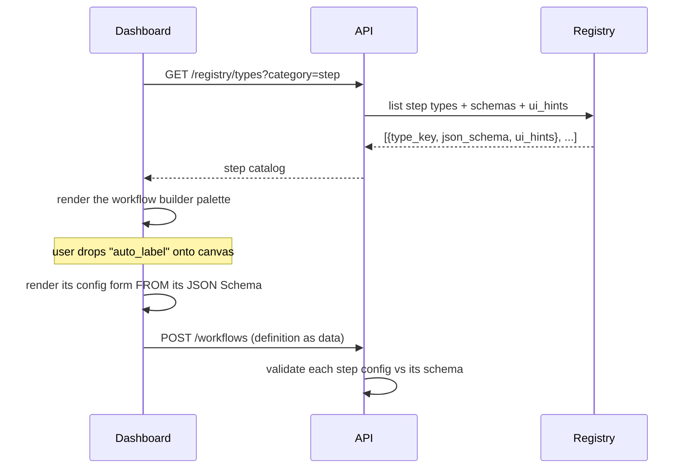

# 07 · API & Dashboard UX

← [Modularity & Extensibility](./06-modularity-and-extensibility.md) · Next → [Controls, Governance & Security](./08-controls-governance-security.md)

This document covers the API surface, how the dashboard is structured, and how the system delivers principle **P6** — *everything in the flow is opened to the user.*

---

## 1. API shape: resources mirror the data model

A REST-ish resource API maps cleanly onto the entities in [doc 02](./02-data-model.md). Predictable URLs, standard verbs, cursor pagination, and JSON bodies validated against the same schemas the engine uses.

```
# Projects & data
GET    /projects
POST   /projects/{id}/data-sources                 # register a video/folder (returns presigned upload)
GET    /projects/{id}/samples?cursor=&class=&review_status=   # metadata query; no bytes
GET    /samples/{id}/image-url                      # → short-lived presigned GET (see doc 04)

# Ontology
GET/POST /projects/{id}/ontologies
GET/POST /ontologies/{id}/classes

# Annotations (append-only)
GET    /samples/{id}/annotations                    # revision history
POST   /samples/{id}/annotations                    # creates a NEW revision

# Datasets / versioning
GET/POST /projects/{id}/datasets
POST   /datasets/{id}/commits                        # create commit (server does the CAS, doc 03)
GET    /datasets/{id}/commits/{commit}               # immutable; aggressively cacheable
GET/POST /datasets/{id}/refs                          # branches & tags
POST   /datasets/{id}/merge                           # body: {from, into, merge_policy}
POST   /projects/{id}/dataset-links                   # pin a commit OR follow a branch

# Models
GET/POST /projects/{id}/models                        # a model_version records trained_on_commit

# Workflows & runs
GET/POST /projects/{id}/workflows                     # definition is data; versioned
POST   /workflows/{id}/runs                           # start a run (body: params)
GET    /runs/{id}                                     # status, config, input/output refs, metrics
GET    /runs/{id}/events                              # live timeline (also via stream)
POST   /runs/{id}/cancel
POST   /runs/{id}/gates/{step}/resolve                # satisfy a human gate

# The registry — what makes the UI self-describing
GET    /registry/types?category=step                  # list step types
GET    /registry/types/{type_key}                     # JSON Schema + ui_hints for forms
```

**Design notes**
- **Immutable resources are cacheable** (`GET /commits/{commit}` → `Cache-Control: immutable`). Mutable ones (refs, run status) are not. This mirrors the storage caching story in [doc 04 §3](./04-storage-performance-access.md#3-caching--and-why-content-addressing-makes-it-free).
- **Bytes are never in API bodies.** Image/model access is always "API returns a presigned URL; client fetches direct." ([doc 04 §2](./04-storage-performance-access.md#2-serving-large-data-without-touching-the-app-server))
- **Write bodies are validated against registry schemas** — the same `validate(config, type_key)` used by the engine ([doc 06 §C](./06-modularity-and-extensibility.md#pattern-c--typed-config-via-json-schema-used-by-every-configurable-thing)). One source of truth for "what's a valid step config."
- **Long lists are cursor-paginated** ([doc 04 §5](./04-storage-performance-access.md#5-performance-checklist)).
- **Async work returns a `run`**; the client polls or streams `/runs/{id}/events`. Same shape for every operation (Pattern D).

---

## 2. The self-describing UI (why P6 is nearly free)

The dashboard does **not** hardcode each step's form. It asks the registry what exists and renders from schema:



Consequences:
- **New capability → instantly usable.** Register an `exporter.coco` or a new step, and it appears in the builder with a working, validated form — no front-end change ([doc 06 §1](./06-modularity-and-extensibility.md#1-the-registry-pattern-pluggable-behavior)).
- **Consistency for free.** Every config form, everywhere, is generated the same way, so the product feels coherent and validation is uniform.
- **`ui_hints`** (optional, on the schema) let a type suggest widget choices, grouping, and ordering without the UI needing bespoke knowledge of it.

---

## 3. Dashboard surface (the screens)

The screens follow the data model; each is a thin view over the API.

- **Projects** — the home; pick or create a project (the tenancy boundary).
- **Data sources** — register/upload videos & folders (direct-to-storage upload), see ingest status (a `run`).
- **Sample browser** — fast, filterable grid (thumbnails only — [doc 04 §3](./04-storage-performance-access.md#thumbnails-are-mandatory-for-the-dashboard)); filter by class, review status, source, split. Pure metadata query.
- **Annotation review** — opens the relevant CVAT job(s); on completion, results return as new revisions ([doc 08 §CVAT sync](./08-controls-governance-security.md#cvat-sync)).
- **Datasets & versions** — the commit graph (the gitGraph view from [doc 03](./03-versioning-concurrency-merge.md)), branches/tags, per-commit stats (cached), diff between versions, and **merge** with a chosen policy.
- **Workflow builder** — the schema-driven canvas: drop steps, wire artifacts, set config, save, version, run.
- **Runs** — live timeline of every run (one view over `runs`/`events`); drill into a step to see its exact config, input/output refs, logs, metrics; resolve gates; retry/cancel.
- **Models** — model versions with their `trained_on_commit`, hyperparams, metrics — the reproducibility view (P8).
- **Settings** — ontology editor, storage backends, members/roles, retention.

---

## 4. Opening *every* flow to the user — the checklist

For P6 to be real, each of these must hold. Treat it as an acceptance checklist:

- [ ] Every **step type** is listed and configurable from the registry (no hidden steps).
- [ ] Every **workflow** is viewable and editable as data; users can clone, version, and re-run.
- [ ] Every **run** exposes its exact config, inputs, outputs, logs, metrics, and timing.
- [ ] Every **gate** shows what it's waiting on and links to the action.
- [ ] Every **dataset version** is inspectable (membership, stats, diff) and its **lineage** is traceable (which model labeled it, who reviewed, which model trained on it).
- [ ] Every **config** the system uses is the *same* config the user sees and can change — no privileged parallel path.
- [ ] Every **destructive action** (delete, merge, GC) is visible, audited, and reversible within the retention window ([doc 08](./08-controls-governance-security.md)).

The throughline: the UI is a *window onto the same objects the engine operates on*, never a separate, lossy reflection of them.
