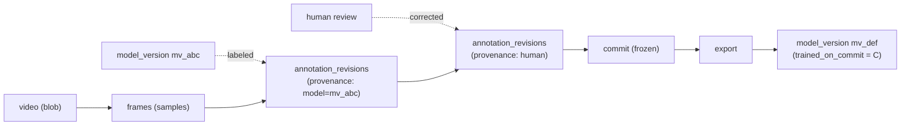
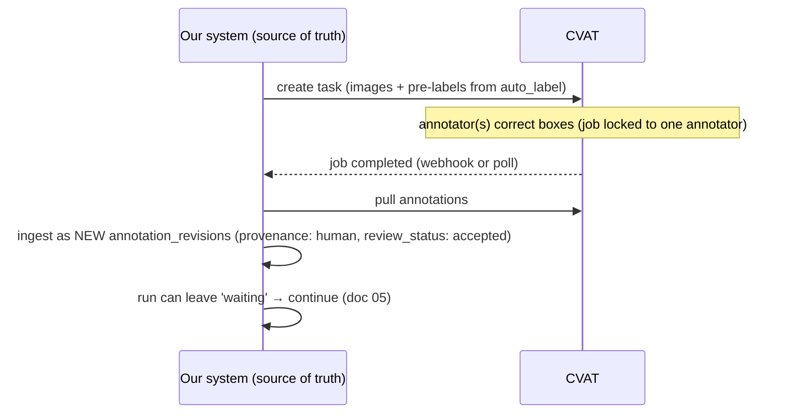

# 08 · Controls, Governance & Security

← [API & Dashboard UX](./07-api-and-dashboard-ux.md) · Next → [Gaps & Considerations](./09-gaps-and-considerations.md)

This document covers the "controls" Yehuda asked about: who can do what, what's validated, how everything is audited, how access stays safe, and how the system stays observable and recoverable. It realizes principle **P9** ([doc 01](./01-principles-and-architecture.md)).

---

## 1. RBAC & permissions {#rbac--permissions}

- **Hierarchy:** `org → project → resources`. Membership and role live on `memberships(org_id, user_id, role)`. Roles, minimally: **owner**, **maintainer** (manage datasets/workflows/models), **annotator** (edit annotations, resolve gates), **viewer** (read-only).
- **Scoping is uniform.** Because every domain row carries `project_id` (the G1 base spine, [doc 02 §G1](./02-data-model.md#g1--the-base-entity-mixin)), authorization is one mechanism: *can this actor act on this project, at this role?* — applied in one place, not re-implemented per endpoint.
- **Permission checks gate the presigned URL.** A client gets a signed URL for a blob **only** after the API confirms the actor may read that sample/commit ([doc 04 §2](./04-storage-performance-access.md#2-serving-large-data-without-touching-the-app-server)). Authorization is enforced at the API; the signature merely carries a time-boxed, single-object grant.
- **Service identities** (workers, the engine) are principals too, with their own least-privilege roles.

---

## 2. Validation {#validation}

Validation is **one mechanism applied everywhere** (Pattern C, [doc 06](./06-modularity-and-extensibility.md#pattern-c--typed-config-via-json-schema-used-by-every-configurable-thing)):

- **Config validation** — every step/exporter/backend config is validated against its registered JSON Schema before a run starts and before a workflow is saved. Bad config can't enter the system.
- **Referential validation** — a commit's `commit_sample` rows must reference real samples and revisions; a `project_dataset_link` must specify *exactly one* of `pinned_commit_id` / `ref_id`; a `train` step's input must be a real export. Enforce with FKs where possible (Pattern G) and explicit checks otherwise.
- **Graph validation** — before a run, the engine validates the workflow graph: no cycles, every `inputs` reference resolves to a declared upstream `output`, types are compatible ([doc 05 §2](./05-workflow-engine.md#2-the-step-contract-p7-artifacts-in--artifacts-out)).
- **Invariant validation** — commits are immutable (reject any write to an existing commit), tags are immutable, append-only tables reject updates. These invariants are enforced, not merely documented.

---

## 3. Audit & lineage {#audit--lineage}

The generic `events` log ([doc 02 §G4](./02-data-model.md#g4--the-generic-run--the-generic-event-log)) is the backbone:

- **Audit trail** — every meaningful mutation (create commit, move branch, edit annotation, start/cancel run, delete, merge, GC) emits an append-only `events` row with actor, target, action, and payload. This is the "who did what, when."
- **Provenance** — each `annotation_revision` records *what produced it* (model vs human, which model version, which author, review status). This is the "where did this label come from."
- **Lineage graph** — chaining the references answers reproducibility questions end-to-end:

From any trained model you can walk backward to the exact commit, the exact revisions, who/what produced them, and the source video. That traceability is the whole point of the versioning design (P8).

---

## 4. Security & least privilege {#least-privilege}

- **Only the API holds DB and storage credentials.** Clients never touch either directly; they receive narrow, short-lived grants (presigned URLs, scoped tokens). ([doc 04 §2](./04-storage-performance-access.md#2-serving-large-data-without-touching-the-app-server))
- **Workers get their own scoped roles** — e.g. the trainer reads a specific export prefix and writes to the models prefix, nothing more. A compromised worker can't roam the bucket.
- **Presigned URLs are minimal:** single object, short TTL, least verb (GET for read, PUT for one upload).
- **Secrets** (DB creds, storage keys, CVAT tokens) live in a secrets manager, not in code or config files; rotated on a schedule.
- **PII awareness** — frames may contain faces or license plates. Depending on the domain this may require blurring, access restriction, or consent handling. Flagged as a real decision in [Gaps §privacy](./09-gaps-and-considerations.md#data-privacy--pii).
- **Transport** — TLS everywhere; signed-cookie or token auth at the CDN edge for cacheable assets ([doc 04 §3](./04-storage-performance-access.md#the-presigned-url--cdn-tension-and-the-resolution)).

---

## 5. CVAT sync (integration controls) {#cvat-sync}

CVAT is a *labeling workstation*, never the source of truth ([doc 01 §3](./01-principles-and-architecture.md#cvat-vs-fiftyone--they-are-not-competitors)). The sync is controlled and one-directional for truth:

- We **lease** a slice of work to CVAT (a task) and **ingest** results back as new revisions — we never let CVAT's internal project become authoritative.
- **Job-level locking** in CVAT prevents two annotators editing the same image; our commit step serializes the ingested revisions ([doc 03 §3](./03-versioning-concurrency-merge.md#3-concurrency-optimistic-lock-free-conflict-explicit)).
- Completion is detected by **webhook** (preferred) or **polling** (fallback); either way the gate step resolves only when results are safely ingested.

---

## 6. Observability {#observability}

- **Run-level** — status, per-step timing, attempts, and errors all come from the `runs`/`events` rows; the dashboard's run view *is* the observability surface ([doc 07 §3](./07-api-and-dashboard-ux.md#3-dashboard-surface-the-screens)).
- **System-level** — standard metrics (API latency/error rate, queue depth, worker/GPU utilization, storage egress) and structured logs shipped to wherever the team centralizes logs.
- **Domain-level** — the metrics that actually matter for this product: labeling throughput, auto-label acceptance rate, dataset growth over time, and model metrics across versions (does `mv_def` beat `mv_abc` on the same eval commit?). These ride on the existing `events`/`metrics`/`model_version` data.

---

## 7. Error handling, retries, recovery {#error-handling}

- **Idempotent steps** make retries safe — re-running with the same `(type, config, inputs)` key returns the existing output ([doc 05 §5](./05-workflow-engine.md#5-idempotency-determinism-resumability)).
- **Resumable runs** restart from the last completed step, since each step persists its outputs as artifacts.
- **Explicit failure state** with captured `error` + `logs_blob_hash`; the UI surfaces it and offers retry/cancel.
- **Backpressure & limits** — GPU steps (`auto_label`, `train`) are queued and concurrency-limited so a flood of work degrades gracefully rather than overrunning resources (matters once on the queue executor — [doc 05 §4](./05-workflow-engine.md#4-executors-grow-without-changing-the-contract)).

---

## 8. Retention & recoverability {#retention}

- **Soft delete is the default** ([doc 02 §G1](./02-data-model.md#g1--the-base-entity-mixin)); hard deletion is a separate, audited GC sweep after a retention window ([doc 03 §GC](./03-versioning-concurrency-merge.md#garbage-collection)).
- **Pinned commits are protected** from GC — the guarantee behind reproducibility.
- **Backups** — Postgres is the high-value target (it's small): point-in-time recovery + regular dumps. Object storage relies on bucket versioning/replication; because blobs are immutable and content-addressed, re-deriving or re-uploading is straightforward.
- The net effect: a wrong delete or a bad merge is recoverable, because nothing authoritative is ever truly overwritten — only pointers move, and history is append-only.
